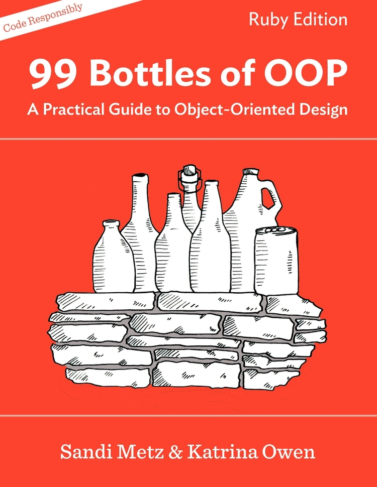

[&lt;&lt; Back to project home](../README.md)

# 99 Bottles of OOP

By the grand [Sandi Metz and Katrina Owen](http://www.sandimetz.com/)

## Links:

- [Purchase 99 Bottles of OOP](http://www.sandimetz.com/99bottles)

## Chapter Notes:

- [Chapter 1. Rediscovering Simplicity](ch01-rediscovering-simplicity.md)
- [Chapter 2. Test Driving Shameless Green](ch02-test-driving-shameless-green.md)
- [Chapter 3. Unearthing Concepts](ch03-unearthing-concepts.md)
- [Chapter 4. Practicing Horizontal Refactoring](ch04-practicing-horizontal-refactoring.md)
- [Chapter 5. Separating Responsibilities](ch05-separating-responsibilities.md)
- [Chapter 6. Replacing Conditionals with Objects](ch06-replacing-conditionals-with-objects.md)

- [Method Versus Message](method-vs-message.md)

- [My GitHub Code][my github code]

[my github code]: https://github.com/trueheart78/99-bottles-of-oop
