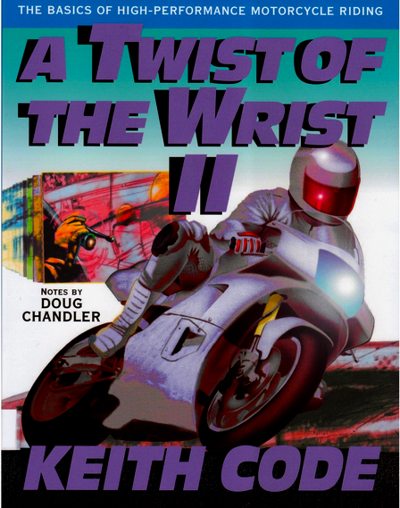

[🔙 🏡](../README.md)

# A Twist of the Wrist II (2013)

By the terrific [Keith Code](https://superbikeschool.com/)

## Links:

- [Purchase A Twist of the Wrist II](https://superbikeschool.com/product/a-twist-of-the-wrist-vol-2/)

## Chapter Notes:

01. **Introduction**
    - [Chapter 1. The Enemy - Survival Reactions](ch01-the-enemy-survival-reactions.md)
02. **Throttle Control**
    - [Chapter 2. Throttle Control - Rule Number One](ch02-throttle-control-rule-number-one.md)
    - [Chapter 3. Throttle Control - Suspension and Traction](ch03-throttle-control-suspension-and-traction.md)
    - [Chapter 4. Throttle Control - Everyman's Ideal Line](ch04-throttle-control-everymans-ideal-line.md)
    - [Chapter 5. Throttle Control - Get It On](ch05-throttle-control-get-it-on.md)
    - [Chapter 6. Throttle Control - The Force](ch06-throttle-control-the-force.md)
03. **Rider Input**
    - [Chapter 7. Rider Input - Riders Create More Problems than Motorcycles are Designed to Handle](ch07-rider-input-riders-create-more-problems-than-motorcycles-are-designed-to-handle.md)
    - [Chapter 8. Rider Input - Holding On](ch08-rider-input-holding-on.md)
    - [Chapter 9. Rider Input - The Problem of Stability](ch09-rider-input-the-problem-of-stability.md)
    - [Chapter 10. Rider Input - Riding and Sliding](ch10-rider-input-riding-and-sliding.md)
    - [Chapter 11. Rider Input - Man Plus Machine](ch11-rider-input-man-plus-machine.md)
04. **Steering**
    - [Chapter 12. Steering - The Forces to Beat](ch12-steering-the-forces-to-beat.md)
    - [Chapter 13. Steering - Steer for the Rear](ch13-steering-steer-for-the-rear.md)
    - [Chapter 14. Steering - The Rules](ch14-steering-the-rules.md)
    - [Chapter 15. Steering - Lazy Turns and the Turn Scale](ch15-steering-lazy-turns-and-the-turn-scale.md)
    - [Chapter 16. Steering - Strange Lines and Quick Turning](ch16-steering-strange-lines-and-quick-turning.md)
    - [Chapter 17. Steering - The Key to Speed](ch17-steering-the-key-to-speed.md)
    - [Chapter 18. Steering - The Three Tools of Turning](ch18-steering-the-three-tools-of-turning.md)
    - [Chapter 19. Steering - Pivot Steering](ch19-steering-pivot-steering.md)
05. **Vision**
    - [Chapter 20. Vision - Lost in Space or Too Fast for What?](ch20-vision-lost-in-space-or-too-fast-for-what.md)
    - [Chapter 21. Vision - Reference Points (RPs) Revisited - The Missing Link](ch21-vision-reference-points-rps-revisited-the-missing-link.md)
    - [Chapter 22. Vision - Wide Screen Control: Different Drills](ch22-vision-wide-screen-control-different-drills.md)
    - [Chapter 23. Vision - The Two-Step](ch23-vision-the-two-step.md)
06. **Braking**
    - [Chapter 24. Braking - Nothing New](ch24-braking-nothing-new.md)
07. **Traction**
    - [Chapter 25. Traction - Pros and Cons and Uses](ch25-traction-pros-and-cons-and-uses.md)
08. **Racing**
    - [Chapter 26. Racing - The Tools and Goals](ch26-racing-the-tools-and-goals.md)
09. **Appendix**
    - [Appendix 1. Rider Checklist](ap01-rider-checklist.md)
    - [Appendix 2. Race Day Record](ap02-race-day-record.md)
    - [Appendix 3. Glossary](ap03-glossary.md)

