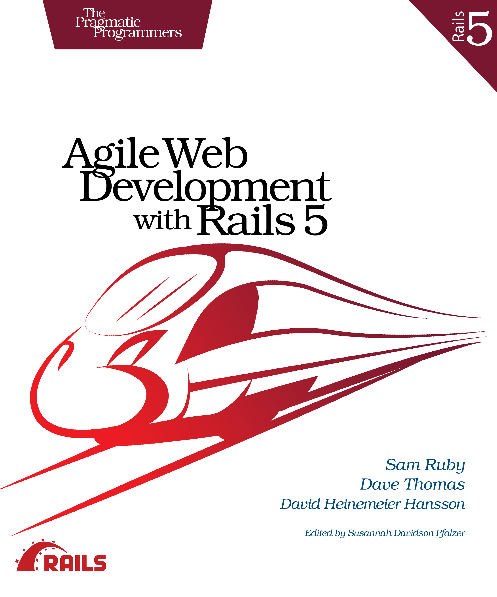

[&lt;&lt; Back to project home](../README.md)

# Agile Web Development with Rails 5

By the tremendous [Sam Ruby, Dave Thomas, and DHH](https://pragprog.com/book/rails5/agile-web-development-with-rails-5)

## Links:

- [Purchase Agile Web Development with Rails 5](https://pragprog.com/book/rails5/agile-web-development-with-rails-5)

## Chapter Notes:

- **Part I. Getting Started**
- [Chapter 1. Installing Rails](ch01-installing-rails.md)
- [Chapter 2. Instant Gratification](ch02-instant-gratification.md)
- [Chapter 3. The Architecture of Rails Applications](ch03-the-architecture-of-rails-applications.md)
- [Chapter 4. Introduction to Ruby](ch04-introduction-to-ruby.md)
- **Part II. Building an Application**
- [Chapter 5. The Depot Application](ch05-the-depot-application.md)
- [Chapter 6. Task A. Creating the Application](ch06-task-a.-creating-the-application.md)
- [Chapter 7. Task B. Validation and Unit Testing](ch07-task-b.-validation-and-unit-testing.md)
- [Chapter 8. Task C. Catalog Display](ch08-task-c.-catalog-display.md)
- [Chapter 9. Task D. Cart Creation](ch09-task-d.-cart-creation.md)
- [Chapter 10. Task E. A Smarter Cart](ch10-task-e.-a-smarter-cart.md)
- [Chapter 11. Task F. Add a Dash of Ajax](ch11-task-f.-add-a-dash-of-ajax.md)
- [Chapter 12. Task G. Check Out!](ch12-task-g.-check-out.md)
- [Chapter 13. Task H. Sending Mail](ch13-task-h.-sending-mail.md)
- [Chapter 14. Task I. Logging In](ch14-task-i.-logging-in.md)
- [Chapter 15. Task J. Internationalization](ch15-task-j.-internationalization.md)
- [Chapter 16. Task K. Deployment and Production](ch16-task-k.-deployment-and-production.md)
- [Chapter 17. Depot Retrospective](ch17-depot-retrospective.md)
- **Part III. Rails in Depth**
- [Chapter 18. Find Your Way Around Rails](ch18-find-your-way-around-rails.md)
- [Chapter 19. Active Record](ch19-active-record.md)
- [Chapter 20. Action Dispatch and Action Controller](ch20-action-dispatch-and-action-controller.md)
- [Chapter 21. Action View](ch21-action-view.md)
- [Chapter 22. Migrations](ch22-migrations.md)
- [Chapter 23. Nonbrowser Applications](ch23-nonbrowser-applications.md)
- [Chapter 24. Rails' Dependencies](ch24-rails-dependencies.md)
- [Chapter 25. Rails Plugins](ch25-rails-plugins.md)
- [Chapter 26. Where to Go from Here](ch26-where-to-go-from-here.md)

