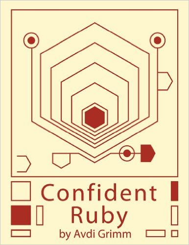

[&lt;&lt; Back to project home](../../README.md)

# Confident Ruby

By the way-too-smart [Avdi Grimm](http://avdi.org).

**This is a book about Ruby, and about joy.**

- [Chapter 1. Introduction](ch1-introduction.md)
- [Chapter 2. Performing Work](ch2-performing-work.md)
- [Chapter 3. Collecting Input](ch3-collecting-input.md)

