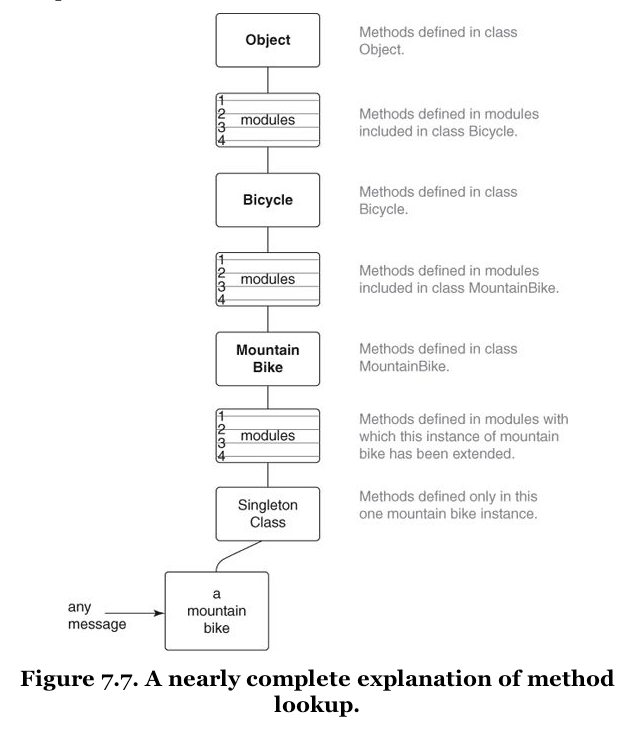
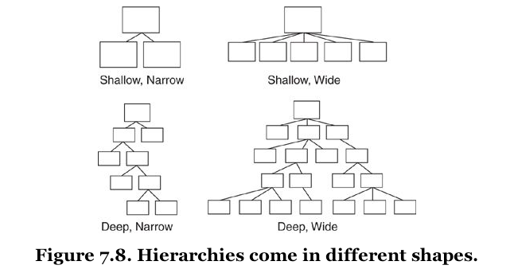

[&lt;&lt; Back to the README](README.md)

# Chapter 7. Sharing Role Behavior with Modules

To reap benefits from using inheritance you must understand not only how to
write inheritable code but also when it makes sense to do so. Use of classical
inheritance is always optional; every problem that it solves can be solved
another way.

## Understanding Roles

Some problems require sharing behavior among otherwise unrelated objects. This
common behavior is orthogonal to class; it's a **role** an object plays. Many
of the roles needed by an app will be obvious at design time, but it's also
common to discover unanticipated roles as you write the code.

Using a role creates dependencies among the objects involved and these dependencies
introduce risks that you must take into account when deciding among design
options.

### Finding Roles

A `Preparer` role suggests that there's also a parallel `Preparable` role, as these
things often come in pairs.

When a role needs shared behavior you're faced with the problem of organizing the
shared code.

Methods can be defined in a Ruby *module* and then the module can be added to any
object. Modules provide a perfect way to allow objects of different classes to
play a common role using a single set of code.

The total set of messages to which an object can respond include

- Those it implements
- Those implemented in all objects above it in the hierarchy
- Those implemented in any module that has been added to it
- Those implemented in all mopdules added to any object above it in the hierarchy.

### Organizing Responsibilities

Instead of knowing details about other classes, an object should send them messages.

### Removing Unnecessary Dependencies

Duck type discovery can lead to adding methods to a module, so that a role may be
fulfilled. 

#### Letting Objects Speak for Themselves

Using a separate class to manage a class is patently redundant; a class is an
object, they have their own behavior, they manage themselves. Requiring that
other objects know about a third party `util` class to get behavior from it
complicates the code by adding an unnecessary dependency.

An object should manage itself; it should contain its own behavior. If your
interest is in object B, you should not be forced to know about object A if
your only use is to find things out about B.

Just as strings should respond to `empty?` and can speak for themselves, targets
should respond to `schedulable?`. The `schedulable?` method should be added to
the interface of the `Schedulable` role.

### Writing the Concrete Code

Start by writing a `schedulable?` method in an arbitrary concrete class. Once
you have a version that works for that you can refactor your way to a code
arrangement that allows all `Schedulable` classes to share the behavior.

**Again, this is promoting the method.** A
*push-everything-in-and-then-pull-some-things-out* approach, a lot like an
interface.

### Extracting the Abstraction

A bike might be schedulable, and the subclasses thereof, but a mechanic and a
vehical should also be schedulable. So, this is not the best fit for inheritance
but for a module.

The rules for modules are the same as for classical inheritance. If a module
sends a message it must provide an implementation, even if that implementation
merely raises an error indicating that users of the module must implement the
method.

The coding techniques for the template method are the same because the method
lookup follows the same path.

Classical inheritance is for an **is-a** while a module is for a **behaves-like**.

However, the coding techniques are very similar and this similarity exists
because both techniques rely on automatic message delegation.

### Looking Up Methods

In Ruby, the lookup first happens on the class, and then sends the `method_missing`
message to the class.

Then Ruby climbs the hierarchical ladder, and once complete, moves on to check
included modules for existence.

When a single class includes several different modules, the modules are placed
in the method lookup path in *reverse* order of module inclusion. This is for
when the `include` keyword is used.

There is also an `extend` keyword that can be used for a single object.

**Warning:** The above is accurate enough, but it is not the complete story. Check
the object hierarchy of the Ruby version you are using as some may differ.

### Inheriting Role Behavior

Modules can include other modules Modules can override the methods defined in
other modules. 

## Write Inheritable Code

### Recognizing the Antipatterns

An object that uses a variable with a name like `type` or `category` to determin
what message to send to `self` contains highly related but slightly different
types.

When a sending object checks the class of a receiving object to determine what
message to send, you have overlooked a duck type.

In addition to sharing an interface, duck types might also share behavior.
When they do, place the shared code in a module and include that module in each
class or object that plays the role.

### Insist on the Abstraction

All of the code in an abstract superclass should apply to every class that inherits
it. **Superclasses should not contain code that applies to some, but not all,
subclasses.** **This restriction also applies to modules: the code in a module
must apply to all who use it.**

Faulty abstractions cause inherting objects to contain incorrect behavior.

If you have have a subclass that overrides a method to raise an exception like
"does not implement", that is a symptom of this problem. When subclasses
override a method to declare that they *do not do that thing* they come very
close to declaring that they *are not that thing.* Avoid this.

### Honor the Contract

Subclasses agree to a *contract*l they promise to be substitutable for their
superclasses. They are not permitted to do anything that forces others to check
their type in order to know how to treat them or what to expect of them.

**In order for a type system to be sane, subtypes must be substitutable for
their supertypes.**

### Use the Template Method Pattern

This is the fundamental coding technique for creating inheritable code. This is
what allows you to separate the abstract from the concrete.

### Preemptively Decouple Classes

Avoid writing code that requires its inheritors to send `super`; instead use
hook messages to allow sublcasses to participate while absolving them of
responsibility for knowing the abstract algorithm. Writing code that requires
subclasses to send `super` adds an additional dependency.

However, a deeper hierarchy could cause problems, since you can't easily do
a hook chain. Be wary.

### Create Shallow Hierarchies

The limitations of hook methods are just one of the many reasons to create shallow
hierarchies.

Shallow hierarchies are easy to understand. Shallow but wide hierarchies are
slightly more complicated. Deep and narrow ones are even a bit more challenging,
and can snowball. Deep and wide should be avoided as they are difficult to
understand and costly to maintain.

Deep hierarchies define a very long search path for message resolution and
provide numerous opportunities for objects in that path to add behavior as
the message passes by.

Another issue is that programmers tend to be familiar with just the classes at
their tops and bottoms; that is, they tend to understand only the behavior
implemented at the boundaries of the search path. The classes in the middle
get the short shrift.

