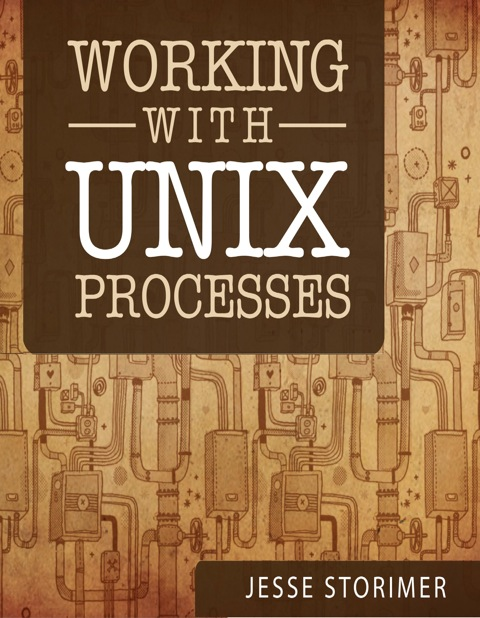

[&lt;&lt; Back to project home](../../README.md)

# Working with Unix Processes

By the tremendous [Jesse Storimer](http://www.jstorimer.com/)

[Purchase](http://www.jstorimer.com/products/working-with-unix-processes)

Notes:

- [Chapter 1. Primer](ch01-primer.md)
- [Chapter 2. Processes Have IDs](ch02-processes-have-ids.md)
- [Chapter 3. Processes Have Parents](ch03-processes-have-parents.md)
- [Chapter 4. Processes Have File Descriptors](ch04-processes-have-file-descriptors.md)
- [Chapter 5. Processes Have Resource Limits](ch05-processes-have-resource-limits.md)
- [Chapter 6. Processes Have an Enviroment](ch06-processes-have-an-enviroment.md)
- [Chapter 7. Processes Have Arguments](ch07-processes-have-arguments.md)
- [Chapter 8. Processes Have Names](ch08-processes-have-names.md)
- [Chapter 9. Processes Have Exit Codes](ch09-processes-have-exit-codes.md)
- [Chapter 10. Processes Can Fork](ch10-processes-can-fork.md)
- [Chapter 11. Orphaned Processes](ch11-orphaned-processes.md)
- [Chapter 12. Processes Are Friendly](ch12-processes-are-friendly.md)
- [Chapter 13. Processes Can Wait](ch13-processes-can-wait.md)
- [Chapter 14. Zombie Processes](ch14-zombie-processes.md)
- [Chapter 15. Processes Can Get Signals](ch15-processes-can-get-signals.md)
- [Chapter 16. Processes Can Communicate](ch16-processes-can-communicate.md)
- [Chapter 17. Daemon Processes](ch17-daemon-processes.md)
- [Chapter 18. Spawning Terminal Processes](ch18-spawning-terminal-processes.md)
- [Chapter 19. Ending](ch19-ending.md)
- [Chapter 20. Appendix 1 - How Resque Manages Processes](ch20-appendix-1---how-resque-manages-processes.md)
- [Chapter 21. Appendix 2 - How Unicorn Reaps Worker Processes](ch21-appendix-2---how-unicorn-reaps-worker-processes.md)
- [Chapter 22. Appendix 3 - Preforking Servers](ch22-appendix-3---preforking-servers.md)
- [Chapter 23. Appendix 4 - Spyglass](ch23-appendix-4---spyglass.md)

