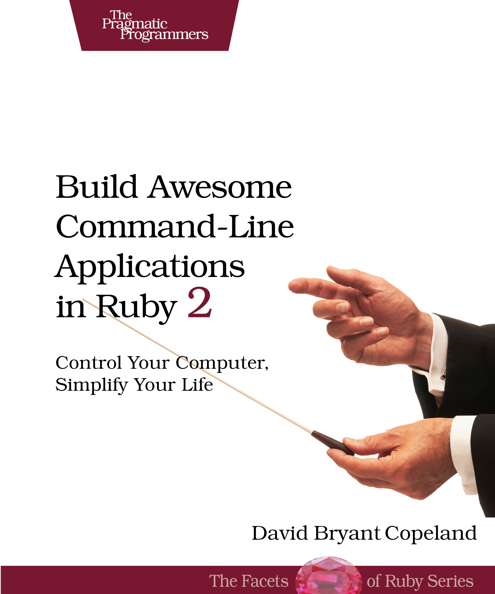

[&lt;&lt; Back to project home](../README.md)

# Build Awesome Command-Line Applications in Ruby 2

By the unbelievable [David Copeland](http://naildrivin5.com/)

## Links:

- [Purchase Build Awesome Command-Line Applications in Ruby 2](https://pragprog.com/book/dccar2/build-awesome-command-line-applications-in-ruby-2)

## Chapter Notes:

- [Chapter 1. Have a Clear and Concise Purpose](ch01-have-a-clear-and-concise-purpose.md)
- [Chapter 2. Be Easy to Use](ch02-be-easy-to-use.md)
- [Chapter 3. Be Helpful](ch03-be-helpful.md)
- [Chapter 4. Play Well with Others](ch04-play-well-with-others.md)
- [Chapter 5. Delight Casual Users](ch05-delight-casual-users.md)
- [Chapter 6. Make Configuration Easy](ch06-make-configuration-easy.md)
- [Chapter 7. Distribute Painlessly](ch07-distribute-painlessly.md)
- [Chapter 8. Test, Test, Test](ch08-test-test-test.md)
- [Chapter 9. Be Easy to Maintain](ch09-be-easy-to-maintain.md)
- [Chapter 10. Adding Color, Formatting, and Interactivity](ch10-adding-color-formatting-and-interactivity.md)
- **Appendices**
- [Appendix 1. Common Command-Line Gems and Libraries](ap01-common-command-line-gems-and-libraries.md)

