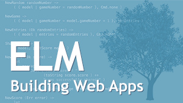

[&lt;&lt; Back to project home](../README.md)

# Building Web Apps with Elm (course)

By the marvelous [Mike and Nicole](https://pragmaticstudio.com/courses/elm)

## Links:

- [Purchase Building Web Apps with Elm (course)](https://pragmaticstudio.com/courses/elm)

## Chapter Notes:

- [Chapter 1. Introduction](ch01-introduction.md)
- [Chapter 2. Hello, Elm!](ch02-hello-elm.md)
- [Chapter 3. Compiling and Running](ch03-compiling-and-running.md)
- [Chapter 4. Calling Functions](ch04-calling-functions.md)
- [Chapter 5. Defining Functions](ch05-defining-functions.md)
- [Chapter 6. Rendering HTML](ch06-rendering-html.md)
- [Chapter 7. Not Your Father's Type System](ch07-not-your-fathers-type-system.md)
- [Chapter 8. Currying for the Curious](ch08-currying-for-the-curious.md)
- [Chapter 9. Modeling Application State with Records](ch09-modeling-application-state-with-records.md)
- [Chapter 10. Type Aliases](ch10-type-aliases.md)
- [Chapter 11. Mapping Over HTML Lists](ch11-mapping-over-html-lists.md)
- [Chapter 12. Updating the Model via Messages](ch12-updating-the-model-via-messages.md)
- [Chapter 13. The Elm Architecture At Work](ch13-the-elm-architecture-at-work.md)
- [Chapter 14. Summing Points](ch14-summing-points.md)
- [Chapter 15. Intro to Effects and Commands](ch15-intro-to-effects-and-commands.md)
- [Chapter 16. Fetching Data from an API](ch16-fetching-data-from-an-api.md)
- [Chapter 17. Decoding JSON](ch17-decoding-json.md)
- [Chapter 18. Failures, Maybe?](ch18-failures-maybe.md)
- [Chapter 19. Posting JSON to an API](ch19-posting-json-to-an-api.md)
- [Chapter 20. Reacting to Input Fields](ch20-reacting-to-input-fields.md)
- [Chapter 21. Organizing Code](ch21-organizing-code.md)
- [Chapter 22. Designing Around Concepts](ch22-designing-around-concepts.md)

