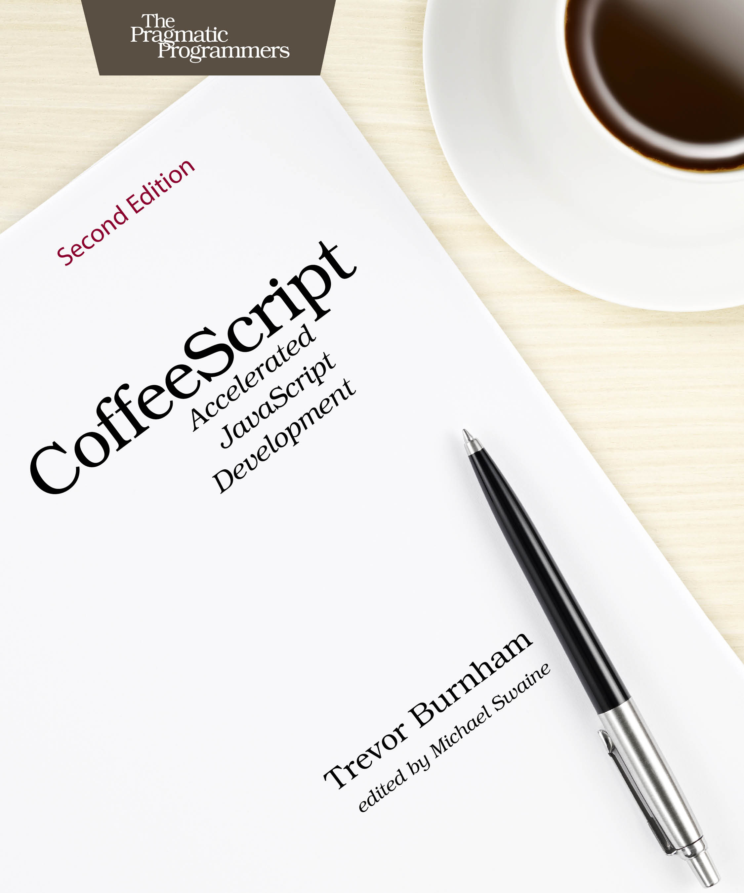

[&lt;&lt; Back to project home](../README.md)

# Coffeescript

By the fantastic [Trevor Burnham](http://trevorburnham.com/)

[Purchase](https://pragprog.com/book/tbcoffee2/coffeescript)

Notes:

- [Chapter 1. Getting Started](ch01-getting-started.md)
- [Chapter 2. Functions, Scope, and Context](ch02-functions-scope-and-context.md)
- [Chapter 3. Collections, Iteration, and Destructuring](ch03-collections-iteration-and-destructuring.md)
- [Chapter 4. Classes, Prototypes, and Inheritance](ch04-classes-prototypes-and-inheritance.md)
- [Chapter 5. Web Applications with jQuery and Backbone.js](ch05-web-applications-with-jquery-and-backbone.js.md)
- [Chapter 6. Web Servers with Node and Express](ch06-web-servers-with-node-and-express.md)
- [Chapter 7. Testing with Intern](ch07-testing-with-intern.md)

