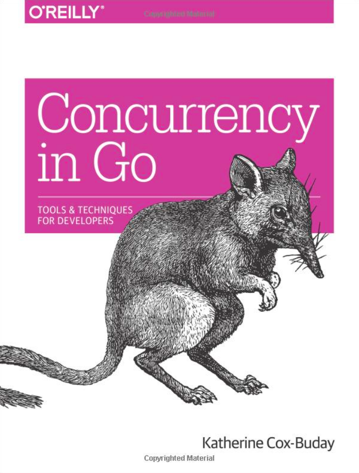

[🔙 🏡](../README.md)

# Concurrency in Go (2017)

By the terrific [Katherine Cox-Buday](https://katherine.cox-buday.com/)

## Links:

- [Purchase Concurrency in Go](https://www.amazon.com/Concurrency-Go-Tools-Techniques-Developers-dp-1491941197/dp/1491941197/)

## Chapter Notes:

- [Chapter 1. An Introduction to Concurrency](ch01-an-introduction-to-concurrency.md)
- [Chapter 2. Modeling Your Code: Communicating Sequential Processes](ch02-modeling-your-code-communicating-sequential-processes.md)
- [Chapter 3. Go's Concurrency Building Blocks](ch03-gos-concurrency-building-blocks.md)
- [Chapter 4. Concurrency Patterns in Go](ch04-concurrency-patterns-in-go.md)
- [Chapter 5. Concurrency at Scale](ch05-concurrency-at-scale.md)
- [Chapter 6. Goroutines and the Go Runtime](ch06-goroutines-and-the-go-runtime.md)
- [Chapter 7. Appendix](ch07-appendix.md)

