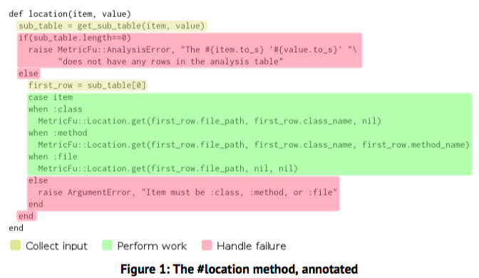

[&lt;&lt; Back to the README](README.md)

# Chapter 1. Introduction

*Ruby is designed to make programmers happy."* - Yukhiro "Matz" Matsumoto

**This is a book about Ruby, and about joy.**

Remember how you felt when you first saw the following code?

```ruby
3.times do
  puts "Hello, Ruby world!"
end
```

## Ruby Meets the Real World

Programming in Ruby was akin to programming in pseudocode; short, clear, intent-
revealing stanzas. No tedious boilerplate; no cluttered thickets of syntax.

As things like nested `if/then/else` logic and `&&` conditionals crept in, the
code began to lose its beauty. Objects stopped feeling like entities accepting
messages, and started to feel more like big bags of attributes.

The happiness continued to be drained.

## Confident Code

Applications usually go from idealistic beginnings to somewhat less satisfying
daily realities. A steady decline in how fun a project is the larger and older
it becomes. It probably even seems like the standard project trajectory.

You will see a collection of time-test techniques and patterns, all tied together
by **self-confidence**.

The principal task will be: **writing clear, uncluttered methods.**

## A Good Story, Poorly Told

Choose Your Own Adventure books worked great, if read the intended way. Reading
straight through, however, is surreal.

Imagine that if, instead of the choices at the end of the page, they were all
at the beginning, asking you where you came. It would be a terrible narrative
with a lot of mental baggage for getting through a single page.

## Code as Narrative

Code cajn tell a story as well. One about a problem that needed to be solved,
and the path the dev(s) chose to accomplish it.

A single method is like a page in a story.

## The Four Parts of a Method

A line of code in a method falls into one of the following four roles:

1. Collecting input
2. Performing work
3. Delivering output
4. Handling failures

*"Diagnostic" and "cleanup" can also appear, but much less frequently*

Imagine if you colored the lines in a method to understand the different roles



There are no output lines, and the proper `else...end` delimeters are handling
failures.

Notice that the colors aren't grouped together, meaning that input is collected
sporadically, as well as failure handling.

Consider the code **time code**: the haphazard mixing of the parts of a method.
And the disorganization causes difficulties during refactoring, as it is prone
to breaking.

Methods that tell good stories lump these four parts of a method together in
distinct stripes, rather than mixing them, and the order that they happen in
matches the the manner that they are listed above.
