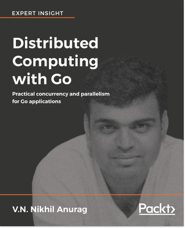

[🔙 🏡](../README.md)

# Distributed Computing with Go

By the terrific [V.N. Nikhil Anurag](https://twitter.com/nikhilnulkar)

## Links:

- [Purchase Distributed Computing with Go](https://www.packtpub.com/application-development/distributed-computing-go)

## Chapter Notes:

- [Chapter 1. Development Environment for Go](ch01-development-environment-for-go.md)
- [Chapter 2. Understanding Goroutines](ch02-understanding-goroutines.md)
- [Chapter 3. Channels and Messages](ch03-channels-and-messages.md)
- [Chapter 4. The RESTful Web](ch04-the-restful-web.md)
- [Chapter 5. Introducing Goophr](ch05-introducing-goophr.md)
- [Chapter 6. Goophr Concierge](ch06-goophr-concierge.md)
- [Chapter 7. Goophr Librarian](ch07-goophr-librarian.md)
- [Chapter 8. Deploying Goophr](ch08-deploying-goophr.md)
- [Chapter 9. Foundations of Web Scale Architecture](ch09-foundations-of-web-scale-architecture.md)

