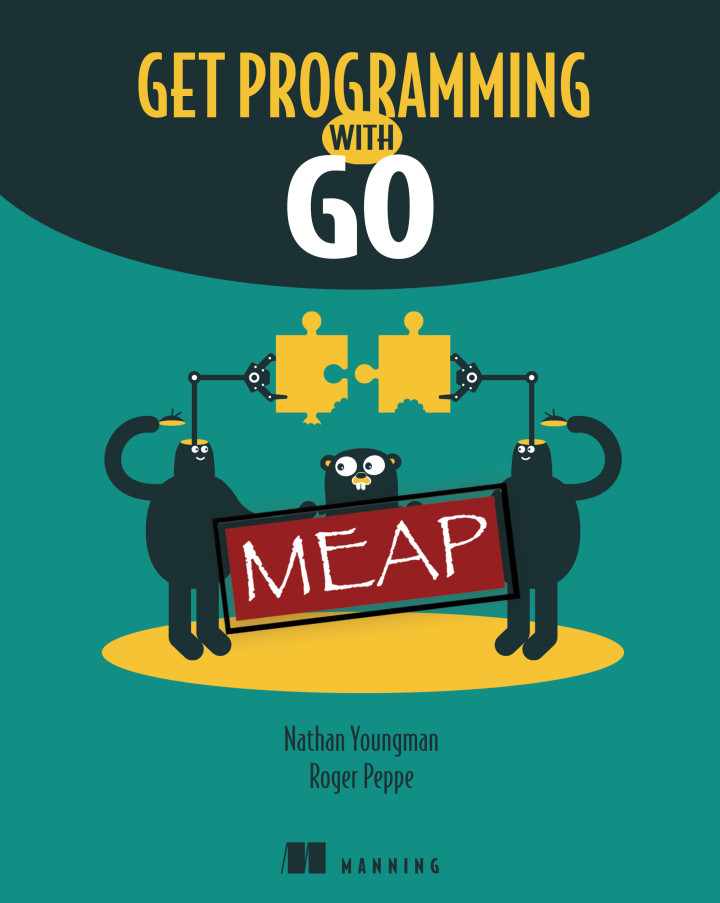

[&lt;&lt; Back to project home](../README.md)

# Get Programming with Go

By the fantastic [Nathan Youngman & Roger Peppe](https://nathany.com/)

## Links:

- [Purchase Get Programming with Go](https://www.manning.com/books/get-programming-with-go)

## Chapter Notes:

1. **Getting Started**
  - [Chapter 1. Get Ready, Get Set, Go](ch01-get-ready-get-set-go.md)
1. **Imperative Programming**
  - [Chapter 2. A Glorified Calculator](ch02-a-glorified-calculator.md)
  - [Chapter 3. Loops and Branches](ch03-loops-and-branches.md)
  - [Chapter 4. Variable Scope](ch04-variable-scope.md)
  - [Chapter 5. Capstone: Ticket to Mars](ch05-capstone-ticket-to-mars.md)
1. **Types**
  - [Chapter 6. Real Numbers](ch06-real-numbers.md)
  - [Chapter 7. Whole Numbers](ch07-whole-numbers.md)
  - [Chapter 8. Big Numbers](ch08-big-numbers.md)
  - [Chapter 9. Multilingual Text](ch09-multilingual-text.md)
  - [Chapter 10. Converting Between Types](ch10-converting-between-types.md)
  - [Chapter 11. Capstone: The Vigenère Cipher](ch11-capstone-the-vigen-re-cipher.md)
1. **Building Blocks**
  - [Chapter 12. Functions](ch12-functions.md)
  - [Chapter 13. Methods](ch13-methods.md)
  - [Chapter 14. First-Class Functions](ch14-first-class-functions.md)
  - [Chapter 15. Capstone: Temperature Tables](ch15-capstone-temperature-tables.md)
1. **Collections**
  - [Chapter 16. Arrayed in Splendor](ch16-arrayed-in-splendor.md)
  - [Chapter 17. Slices are Windows Into Arrays](ch17-slices-are-windows-into-arrays.md)
  - [Chapter 18. A Bigger Slice](ch18-a-bigger-slice.md)
  - [Chapter 19. The Ever Versatile Map](ch19-the-ever-versatile-map.md)
  - [Chapter 20. Capstone: A Slice of Life](ch20-capstone-a-slice-of-life.md)
1. **State and Behavior**
  - [Chapter 21. A Little Structure](ch21-a-little-structure.md)
  - [Chapter 22. Go's Got No Class](ch22-gos-got-no-class.md)
  - [Chapter 23. Composition and Forwarding](ch23-composition-and-forwarding.md)
  - [Chapter 24. Interfaces](ch24-interfaces.md)
  - [Chapter 25. Capstone: Martian Animal Sanctuary](ch25-capstone-martian-animal-sanctuary.md)
1. **Down the Gopher Hole**
  - [Chapter 26. Pointers](ch26-pointers.md)
  - [Chapter 27. Much Ado About Nil](ch27-much-ado-about-nil.md)
  - [Chapter 28. To Err is Human](ch28-to-err-is-human.md)
  - [Chapter 29. Capstone: Sudoku Rules](ch29-capstone-sudoku-rules.md)
1. **Concurrent Programming**
  - [Chapter 30. Goroutines and Concurrency](ch30-goroutines-and-concurrency.md)
  - [Chapter 31. Concurrent State](ch31-concurrent-state.md)
  - [Chapter 32. Capstone: Life on Mars](ch32-capstone-life-on-mars.md)
1. **Where to Go From Here**
  - [Chapter 33. Where to Go From Here](ch33-where-to-go-from-here.md)

