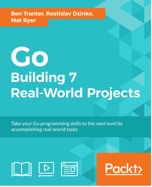

[🔙 🏡](../README.md)

# Go - Building 7 Real-World Projects

By the marvelous [Ben Tranter, Rostislav Dzinko, Mat Ryer](https://www.packtpub.com/application-development/go-building-7-real-world-projects)

## Links:

- [Purchase Go - Building 7 Real-World Projects](https://www.packtpub.com/application-development/go-building-7-real-world-projects)

## Chapter Notes:

01. **Module 1 - CMS**
    - [Chapter 1. Intro to the Go Programming Language](ch01-intro-to-the-go-programming-language.md)
    - [Chapter 2. Creating a Simple Website](ch02-creating-a-simple-website.md)
    - [Chapter 3. Building a Content Management System Dashboard](ch03-building-a-content-management-system-dashboard.md)
    - [Chapter 4. Capturing Web Analytics](ch04-capturing-web-analytics.md)
    - [Chapter 5. Building a User Login/Authentication System](ch05-building-a-user-login-authentication-system.md)
    - [Chapter 6. Exposing Data through a REST API](ch06-exposing-data-through-a-rest-api.md)
    - [Chapter 7. Writing a Real-Time Chat Server](ch07-writing-a-real-time-chat-server.md)
02. **Module 2 - Deployment and Testing**
    - [Chapter 8. Deploying Your Application - Automatically](ch08-deploying-your-application-automatically.md)
    - [Chapter 9. Advanced Debugging and Testing](ch09-advanced-debugging-and-testing.md)
03. **Module 3 - Finding Domain Names**
    - [Chapter 10. Command-Line Tools to Find Domain Names](ch10-command-line-tools-to-find-domain-names.md)
04. **Module 4 - Building Distributed Systems**
    - [Chapter 11. Building Distributed Systems and Working with Flexible Data](ch11-building-distributed-systems-and-working-with-flexible-data.md)
05. **Module 5 - Exposing Data and Functionality**
    - [Chapter 12. Exposing Data and Functionality through a RESTful Data Web Services API](ch12-exposing-data-and-functionality-through-a-restful-data-web-services-api.md)
06. **Module 6 - Random Recommendations Web Service**
    - [Chapter 13. Random Recommendations Web Service](ch13-random-recommendations-web-service.md)
07. **Module 7 - Filesystem Backup**
    - [Chapter 14. Filesystem Backup](ch14-filesystem-backup.md)
08. **Module 8 - Q&A Application**
    - [Chapter 15. The Google App Engine SDK for Go](ch15-the-google-app-engine-sdk-for-go.md)
    - [Chapter 16. Google Cloud Datastore](ch16-google-cloud-datastore.md)
    - [Chapter 17. Entities and Data Access](ch17-entities-and-data-access.md)
    - [Chapter 18. Google App Engine Users](ch18-google-app-engine-users.md)
    - [Chapter 19. Querying in Google Cloud Datastore](ch19-querying-in-google-cloud-datastore.md)
    - [Chapter 20. Votes](ch20-votes.md)
    - [Chapter 21. Casting a Vote](ch21-casting-a-vote.md)
    - [Chapter 22. Exposting Data Operations over HTTP](ch22-exposting-data-operations-over-http.md)
    - [Chapter 23. Running Apps with Multiple Modules](ch23-running-apps-with-multiple-modules.md)
    - [Chapter 24. Deploying Apps with Multiple Modules](ch24-deploying-apps-with-multiple-modules.md)
    - [Chapter 25. Summary](ch25-summary.md)
    - [Chapter 26. Capstone Project](ch26-capstone-project.md)

