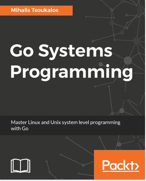

[🔙 🏡](../README.md)

# Go Systems Programming

By the awe-inspiring [Mihalis Tsoukalos](http://www.mtsoukalos.eu/)

## Links:

- [Purchase Go Systems Programming](https://www.packtpub.com/networking-and-servers/go-systems-programming)

## Chapter Notes:

- [Chapter 1. Getting Started with Go and Unix Systems Programming](ch01-getting-started-with-go-and-unix-systems-programming.md)
- [Chapter 2. Writing Programs in Go](ch02-writing-programs-in-go.md)
- [Chapter 3. Advanced Go Features](ch03-advanced-go-features.md)
- [Chapter 4. Go Packages, Algorithms, and Data Structures](ch04-go-packages-algorithms-and-data-structures.md)
- [Chapter 5. Files and Directories](ch05-files-and-directories.md)
- [Chapter 6. File Input and Output](ch06-file-input-and-output.md)
- [Chapter 7. Working with System Files](ch07-working-with-system-files.md)
- [Chapter 8. Processes and Signals](ch08-processes-and-signals.md)
- [Chapter 9. Goroutines - Basic Features](ch09-goroutines-basic-features.md)
- [Chapter 10. Goroutines - Advanced Features](ch10-goroutines-advanced-features.md)
- [Chapter 11. Writing Web Applications in Go](ch11-writing-web-applications-in-go.md)
- [Chapter 12. Network Programming](ch12-network-programming.md)

