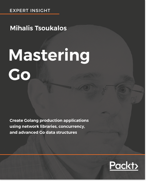

[🔙 🏡](../README.md)

# Mastering Go (2018)

By the awe-inspiring [Mihalis Tsoukalos](http://www.mtsoukalos.eu/)

## Links:

- [Purchase Mastering Go](https://www.packtpub.com/networking-and-servers/mastering-go)

## Chapter Notes:

- [Chapter 1. Go and the Operating System](ch01-go-and-the-operating-system.md)
- [Chapter 2. Understanding Go Internals](ch02-understanding-go-internals.md)
- [Chapter 3. Working with Basic Go Data Types](ch03-working-with-basic-go-data-types.md)
- [Chapter 4. Enhancing Go Code with Data Structures](ch04-enhancing-go-code-with-data-structures.md)
- [Chapter 5. What You Might Not Know About Go Packages](ch05-what-you-might-not-know-about-go-packages.md)
- [Chapter 6. Reflection and Interfaces for All Seasons](ch06-reflection-and-interfaces-for-all-seasons.md)
- [Chapter 7. Telling a Unix System What to Do](ch07-telling-a-unix-system-what-to-do.md)
- [Chapter 8. Go Concurrency - Goroutines, Channels, and Pipelines](ch08-go-concurrency-goroutines-channels-and-pipelines.md)
- [Chapter 9. Go Concurrency - Advanced Topics](ch09-go-concurrency-advanced-topics.md)
- [Chapter 10. Code Testing, Optimization, and Profiling](ch10-code-testing-optimization-and-profiling.md)
- [Chapter 11. The Foundations of Network Programming in Go](ch11-the-foundations-of-network-programming-in-go.md)
- [Chapter 12. Network Programming- Building Servers and Clients](ch12-network-programming-building-servers-and-clients.md)

