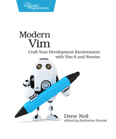

[🔙 🏡](../README.md)

# Modern Vim (May 2018)

By the terrific [Drew Neil](https://pragprog.com/book/modvim/modern-vim)

## Links:

- [Purchase Modern Vim](https://pragprog.com/book/modvim/modern-vim)

## Chapter Notes:
- [Chapter 1. Get Modern Vim](ch01-get-modern-vim.md)
- [Chapter 2. Installing Plugins](ch02-installing-plugins.md)
- [Chapter 3. Opening Files](ch03-opening-files.md)
- [Chapter 4. Working with the Quickfix List](ch04-working-with-the-quickfix-list.md)
- [Chapter 5. Neovim's Built-In Terminal Emulator](ch05-neovims-built-in-terminal-emulator.md)
- [Chapter 6. Sessions](ch06-sessions.md)
- [Chapter 7. Configuring Vim](ch07-configuring-vim.md)

**Appendices**
- [Appendix 1. What's Next for Modern Vim](ap01-whats-next-for-modern-vim.md)

