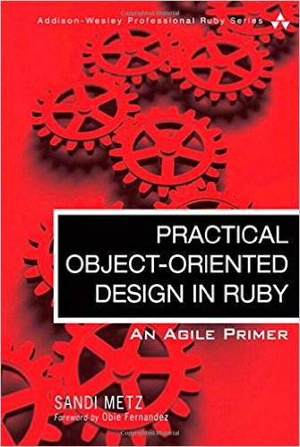

[&lt;&lt; Back to project home](../README.md)

# Practical Object-Oriented Design in Ruby (POODR)

By the wonderful [Sandi Metz](http://sandimetz.com).

**Design is writing code that is easy to change today and cheap to change in the future**

"Others are mucking it up" -
Good design can be good enough so that others making changes don't go right
to the wrong options. It takes intention, but is worth it vs the cost of not
doing it.

Notes:

- [Choosing Relationships](choosing-relationships.md)
- [Testing Keypoints](testing-keypoints.md)
- [Chapter 1. Object-Oriented Design](ch1-oo-design.md)
- [Chapter 2. Designing Classes with a Single Responsibility](ch2-designing-for-single-responsibility.md)
- [Chapter 3. Managing Dependencies](ch3-managing-dependencies.md)
- [Chapter 4. Creating Flexible Interfaces](ch4-creating-flexy-interfaces.md)
- [Chapter 5. Reducing Costs with Duck Typing](ch5-duck-typing-ftw.md)
- [Chapter 6. Acquiring Behavior Through Inheritance](ch6-behavior-thru-inheritance.md)
- [Chapter 7. Sharing Role Behavior with Modules](ch7-behavior-thru-modules.md)
- [Chapter 8. Combining Objects with Composition](ch8-object-composition.md)
- [Chapter 9. Designing Cost-Effective Tests](ch9-cost-effective-tests.md)

Additional notes can be found in the [Ruby Rogues ep 87 notes](rr-ep87-notes.md)

