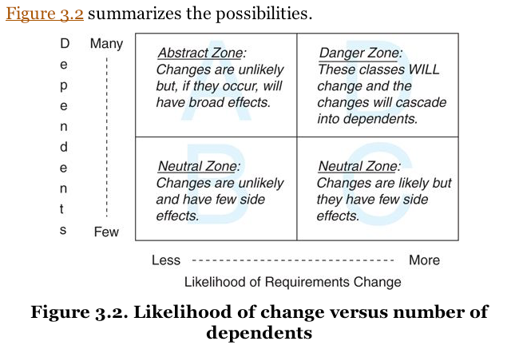

[&lt;&lt; Back to the README](README.md)

# Chapter 3. Managing Dependencies

A single object cannot know everything, so inevitably it will have to talk to
another object.

Each message is initiated by an object to invoke some bit of behavior. So for
any desired behavior, an object either knows it personally, inherits it, or
knows another object who knows it.

SRP objects require that they collaborate to accomplish complex tasks. Knowing
creates a dependency, which can strangle your app if you don't manage them
carefully.

## Understanding Dependencies

An object depends on another if, when one of them changes, the other might be
forced to change in turn.

### Recognising Dependencies

An object has a dependency when it knows:

- the name of another class
- the name of a message that it intends to send to someone other than `self`
- the arguments that a message requires
- the order of those arguments

**Your design challenge is to manage dependencies so that each class has the
fewest possible; a class should know just enough to its job and not one thing
more.**

### Coupling Between Objects (CBO)

The more tightly couple two objects are, the more they behave like a single entity.

### Other Dependencies

Knowing the name of a message you plan to send to someone other than `self`.

Test-to-code over-coupling.

## Writing Loosely Coupled Code

Think of a dependency as a little dot of glue that causes your class to stick to
the things it touches. A few dots are necessary, but too much glue and your
application will harden into a solid block.

### Inject Dependencies

Class name changes can be bothersome, but moreso that there is a strict class
that will only be collaborated with. By passing in an object and depending on
methods to exist, you can get around this. Sometimes, this can even be achieved
without writing any extra lines of code.

Using dependency injection to shape code relies on your ability to recognize that
the responsibility for knowing the name of a class and for knowing the name of a
message to send to that class may belong in different objects.

### Isolate Dependencies

If you cannot remove unnecessary dependencies, you should isolate them within
your class.

Think of every dependency as an alien bacterium that's trying to infect your
class.

#### Isolate Instance Creation

If you can't inject a dependency due to constraints, you should isolate creating
the dependency.

You can at least reveal your dependency this way, and lower the barrier to reuse
making the code easier to refactor when circumstances allow.

#### Isolate Vulnerable External Messages

Knowing an external object responds to a certain message can be tucked away in
local message that abstracts it away, so that the knowledge of the external
dependency is contained, and not strewn about. It makes upkeep easier, as well,
and handles change a lot more gracefully.

### Remove Argument-Order Dependencies

Arguments are often required, and in a certain order. Changing the required order
breaks every existing implementation.

#### Use Hashes for Initialize Arguments

A simple method follows:

```ruby
class Klass
  attr_reader :var1, :var2, :var3
  def initialize(args)
    @var1 = args[:var1]
    @var2 = args[:var2]
    @var3 = args[:var3]
  end
end

Klass.new(var1: 1, var2: 2, var3 'string')
```

This technique adds verbosity, which is often a detriment, but in this case, adds value.

#### Explicitly Define Defaults

The `||` operator may throw you about, if you attempt to use it with a `falsey`
value. Instead, go for the `.fetch` method.

`@var1 = args.fetch(:var1, 10)`

The next step is using a defaults method, that the arguments are merged with.

```ruby
def initialize(args)
  args = defaults.merge(args)
  @var1 = args[:var1]
end

def defaults
  {var1: 10, var2: 20}
end
```

#### Isolate Multiparameter Initialization

If you are forced to work with a fixed argument message, you can create a wrapper
for initialization, where you can control the arguments passed in, and then send
  the message from within it.

You would want a module, and this would be a **factory**. It would not be a module
that would be included in a class, however. It could be, though.

**Do not allow these kinds of external dependencies to permeate your code; protect
yourself by wrapping each in a method that is owned by your own application.**

## Managing Dependency Direction

Dependencies always have a direction.

### Reversing Dependencies

It matters, especially in an app that will change, becayse getting it wrong means
that the dependencies will gradually take over and the application will become
harder and harder to change.

### Choosing Dependency DIrection

**Depend on things that change less often than you do.**

- Some classes are more likely than others to have changes in requirements.
- Concrete classes are more likely to change than abstract classes.
- Changing a class that has many dependents will result in widespread consequences.

#### Understanding Likelihood of Change

Applies to code you use but did not write, like the Ruby standard library.

Ruby base classes change a great deal less often than your own code.

**Framework classes are another story.** They should be more stable than the code
you write, but if the framework is under rapid development, it may change more often
than yours.

**Every class used in your application can be ranked along a scale of how likely
is to undergo a change relative to all other classes.**

#### Recognizing Concretions and Abstractions

Dependency injection is a form of defining an interface. The interface is an
abstraction of the idea that a certain category of things will respond to the
required message.

Interfaces can have dependents and so must be taken into account during design.

#### Avoiding Dependent-Laden Classes

The consequences of having a dependent-laden class that, if changed, will cause
changes to ripple through the application, will be under enormous pressure to
**never** change. **Ever**.

#### Finding Dependencies That Matter



The likelhood of requirements change is represented on the horizontal access.
The number of dependents on the vertical access.

**Depend on things that change less often than you do** is a solid idea for
dependency management.

## Summary

Isolating dependencies allows objects to quickly adapt to unexpected changes.
Depending on abstractions decreases the likelihood of facing these changes.

The key to managing dependencies is to control their direction. The road to
maintenance nirvana is paved with classes that depend on things that change
less often than they do.
