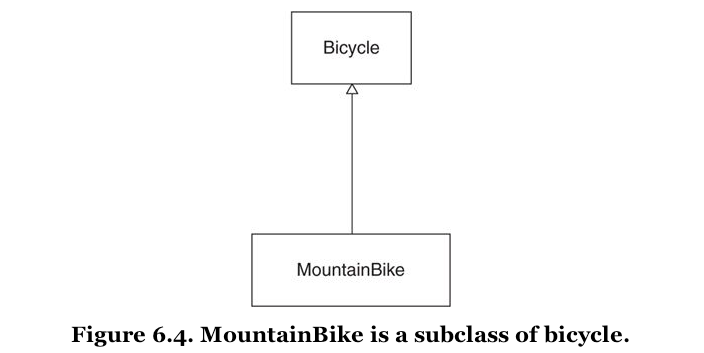

[&lt;&lt; Back to the README](README.md)

# Chapter 6. Acquiring Behavior Through Inheritance

Well designed apps are constructed of reusable code. Small, trustworthy, self-
contained objects with minimal context, clear interfaces, and injected dependencies
are inherently reusable.

## Understanding Classical Inheritance

Inheritance is, ati its core, a mechanism for **automatic message delegation.**
It defines a forwarding path fir not-understood messages.

In class-based inheritance these relationships are defined by creating subclasses.

## Recognizing Where to Use Inheritance

### Starting with a Concrete Class

You might start with a `Bicycle` class that at first is used for road-based bikes.
Once a mountain bike enters the picture though, instead of building a completely
different class, or adding boolean checks to the existing, you should consider
if class-based inheritance is the right fit.

### Embedding Multiple Types

It is easy to extend a class to have more than one responsibility.

Look for **if statements** that check **attributes that hold a category of self**
to determine what message to send to **self**.

The class of an object is simple a specific case of an attribute that holds the
category of self.

### Finding the Embedded Types

Look for variables named `style`, `type`, or `cateogry`. These types of names
are your cute to notice the underlying pattern. What is a class if not a category
or type?

Inheritance solves the problem of highly related types that share common behavior
but differ along some dimension.

### Choosing Inheritance

No matter how complicated the code, the receiving object ultimately handles any
message in one of two ways:

1. It responds directly
2. It passes the message on to some other object for a response

Inheritance provides a way to define two objects as having a relationship such that
when the first receives a message that it does not understand, it *automatically* 
forwards, or delegates, the message to the second. It's as simple as that.

**Single inheritance** sidesteps the complications of *multiple inheritance*,
whereby a subclass is allowed only a single parent superclass.

Think of `NilClass.nil?` as it answers `true`, and `Object.nil?` as it is the
only other class to answer this question, and it does so with `false`.

The face that unknown messages get delegated up the superclass hierarchy implies
that subclasses are everything their superclasses are, plus **more**.

### Drawing Inheritance Relationships

You can use **UML class diagrams** to illustrate class relationships.

The hollow triangle means that the class inherits from said class.

## Misapplying Inheritance

*skimmable*

You can call `super` in a method that you are overriding when performing inheritance,
and call the original method. You can pass details, depend on class attributes, and
handle the return values.

Subclasses are **specializations** of their superclasses. A `MountainBike` should
be everything that a `Bicycle` is, plus more. Any object that expects a `Bicycle`
should be able to interact with a `MountainBike` in blissful ignorance of its
actual class.

