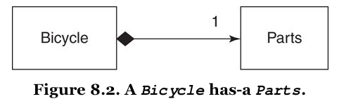
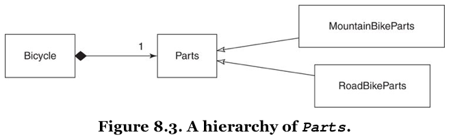

[&lt;&lt; Back to the README](README.md)

# Chapter 8. Combining Objects with Composition

Music *contains* notes, however, it is *not* the notes. It is something more.

You can create software this same way, by using object-oriented composition to
combine simple, independent objects into larger, more complex wholes. In
composition, the larger object is connected to its parts via a **has-a**
relationship.

Inherent in the definition of composition is the idea that, not only does
a bicycle have parts, but it communicates with them via an interface. Part
is a *role* and bicycles are happy to collaborate with any object that plays
the role.

## Composing a Bicycle of Parts

This chapter takes off with code from the end of Chapter 6 - refresh your
brain if you need. :smile:

### Updating the Bicycle Class

The abstract superclass in an inheritance hierarchy can be converted to use
composition. Step 1 is to ignore the existing code and think about how
a bicycle should be composed.

An object can represent a collection of items, not just a single one. A `Parts`
object, for example, that holds `spares`.

Every `Bicycle` needs a `Parts` object; part of what it means to be a `Bicycle`
is to **have-a** `Parts`.



The diagram shows the `Bicycle` and `Parts` classes connected by a line. The line
attaches to `Bicycle` with a black diamond; this black diamond indicates
**composition**, it means that a `Bicycle` is composed of `Parts`. The `Parts`
side has the number "1", meaning that there is just one `Parts` object per
`Bicycle`.

To update the `Bicycle` code, remove most of its code, add a `parts` variable to
hold the `Parts` object, and delegate `spares` to `parts.spares`.

This makes `Bicycle` responsible for three things:

1. knowing its `size`
2. holding onto its `Parts`
3. Answering its `spares`

### Creating a Parts Hierarchy

You can then create a hierarchy for the **has-a** relationship, so that `Parts`
is the abstract superclass for `RoadBikeParts` and `MountainBikeParts`.



Whether a `Bicycle` has `MountainBikeParts` or `RoadBikeParts`, it can still
correctly answer the `size` and `spares` messages.

## Composing the Parts Object

Choosing to create an individual `Part` object to go along with the `Parts`
object makes good sense but can make conversation a challenge. When using the
singular, use the word *object* after, and pluralize as necessary.

You could also choose other names, but this is a common occurrence and other
names may not be as expressive.

So a `Parts` object may contain many `Part` objects.

### Creating a Part


The notation near the `Part` as '1..(asterisk)' indicates that a `Parts` will
have one or more `Part` objects.

At this point, the `Parts` object becomes a simple wrapper around an array of
`Part` objects.

```ruby
chain = Part.new(name: 'chain', description: '10 speed')

road_bike_parts = Parts.new(parts:[chain, road_tire, tape])
```

You can also create the `Parts` object when initializing the `Bicycle`.

While it may be tempting to think of these objects as intances of `Part`,
composition tells you to think of them as objects that play the `Part` role.
They do not have to be a **kind-of** the `Part` class, they just have to act
like one; that is, they must respond to `name`, `description`, and `needs_spare`.

### Making the Parts Object More Like an Array

The `Parts` object does **not** behave like an array and all attempts to treat
it as one will fail.

You could add a `size` method, however, this change starts the `Parts` class down
a slippery slope. Soon, you'll want it to respond to `each`, then `sort`, and
other `Array` messages. The more array-like you make `Parts`, the more like it
you will need it to be.

You could subclass `Parts` as inheriting from `Array`, but also inherits the
addition message from `Array`, as well as all the rest of the public interface,
and this can wreck havoc unexpectedly down the line.

Somewhere in the middle ground between complexity and usability lies the
following solution. The `Parts` class delegates `size` and `each` to the `@parts`
array and includes `Enumerable` to get common traversal and searching methods.

## Manufacturing Parts


