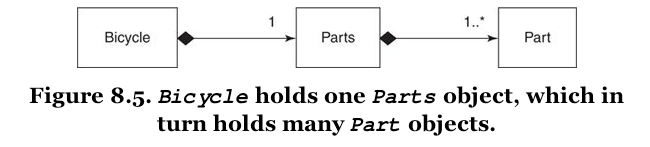

[&lt;&lt; Back to the README](README.md)

# Chapter 8. Combining Objects with Composition

Music *contains* notes, however, it is *not* the notes. It is something more.

You can create software this same way, by using object-oriented composition to
combine simple, independent objects into larger, more complex wholes. In
composition, the larger object is connected to its parts via a **has-a**
relationship.

Inherent in the definition of composition is the idea that, not only does
a bicycle have parts, but it communicates with them via an interface. Part
is a *role* and bicycles are happy to collaborate with any object that plays
the role.

## Composing a Bicycle of Parts

This chapter takes off with code from the end of Chapter 6 - refresh your
brain if you need. :smile:

### Updating the Bicycle Class

The abstract superclass in an inheritance hierarchy can be converted to use
composition. Step 1 is to ignore the existing code and think about how
a bicycle should be composed.

An object can represent a collection of items, not just a single one. A `Parts`
object, for example, that holds `spares`.

Every `Bicycle` needs a `Parts` object; part of what it means to be a `Bicycle`
is to **have-a** `Parts`.


The diagram shows the `Bicycle` and `Parts` classes connected by a line. The line
attaches to `Bicycle` with a black diamond; this black diamond indicates
**composition**, it means that a `Bicycle` is composed of `Parts`. The `Parts`
side has the number "1", meaning that there is just one `Parts` object per
`Bicycle`.

To update the `Bicycle` code, remove most of its code, add a `parts` variable to
hold the `Parts` object, and delegate `spares` to `parts.spares`.

This makes `Bicycle` responsible for three things:

1. knowing its `size`
2. holding onto its `Parts`
3. Answering its `spares`

### Creating a Parts Hierarchy

You can then create a hierarchy for the **has-a** relationship, so that `Parts`
is the abstract superclass for `RoadBikeParts` and `MountainBikeParts`.


Whether a `Bicycle` has `MountainBikeParts` or `RoadBikeParts`, it can still
correctly answer the `size` and `spares` messages.

## Composing the Parts Object

Choosing to create an individual `Part` object to go along with the `Parts`
object makes good sense but can make conversation a challenge. When using the
singular, use the word *object* after, and pluralize as necessary.

You could also choose other names, but this is a common occurrence and other
names may not be as expressive.

So a `Parts` object may contain many `Part` objects.

### Creating a Part



The notation near the `Part` as '1..(asterisk)' indicates that a `Parts` will
have one or more `Part` objects.

At this point, the `Parts` object becomes a simple wrapper around an array of
`Part` objects.

```ruby
chain = Part.new(name: 'chain', description: '10 speed')

road_bike_parts = Parts.new(parts:[chain, road_tire, tape])
```

You can also create the `Parts` object when initializing the `Bicycle`.

While it may be tempting to think of these objects as intances of `Part`,
composition tells you to think of them as objects that play the `Part` role.
They do not have to be a **kind-of** the `Part` class, they just have to act
like one; that is, they must respond to `name`, `description`, and `needs_spare`.

### Making the Parts Object More Like an Array

The `Parts` object does **not** behave like an array and all attempts to treat
it as one will fail.

You could add a `size` method, however, this change starts the `Parts` class down
a slippery slope. Soon, you'll want it to respond to `each`, then `sort`, and
other `Array` messages. The more array-like you make `Parts`, the more like it
you will need it to be.

You could subclass `Parts` as inheriting from `Array`, but also inherits the
addition message from `Array`, as well as all the rest of the public interface,
and this can wreck havoc unexpectedly down the line.

Somewhere in the middle ground between complexity and usability lies the
following solution. The `Parts` class delegates `size` and `each` to the `@parts`
array and includes `Enumerable` to get common traversal and searching methods.

## Manufacturing Parts

Everything would be easier if you could describe the different bikes and then use
your descriptions to magically manufacture the correct `Parts` object for any
bike.

It is easy to describe the combination of parts that make up a specific bike.

The manner in which it makes sense to you is a good sense that maybe using a
factory could help make life even easier, and the code, more expressive.

### Creating the PartsFactory

An object that manufactures other objects is a factory, per chapter 3. 

The word **factory** does not mean difficult or contrived or overly complicated;
it's merely the word OO designers use to concisely communicate the idea of an
object that creates other objects. **Ruby factories are simple and there is no
reason to avoid this intention revealing word.**

Putting knowledge of the configuration structure in a factory has two consequences.
First, the config can be expressed very tersley. Second, once you commit to
keeping the config structure in an array, you should **always** use the factory
to generate new items.

### Leveraging the PartsFactory

Once a factory is up and running, it might take a lot of the burden off from
the object it generates. In the instance of the `Part` class, it can actually
be reduced to an `OpenStruct` instead of a class.

`OpenStruct` is a lot like the `Struct` class, as it provides a convenient way
to bundle a number of attributes into an object. `Struct` differs because it
takes position order initialization while `OpenStruct` takes a hash and then
derives attributes appropriately.

Remember that the `Part` is a role, and removing the class and using an
`OpenStruct` shouldn't bother you. You can actually have the `OpenStruct` be
part of the code that the message uses, instead of being a standalone class.

## The Composed Bicycle

`Bicycle` **has-a** `Parts`, which in turn **has-a** collection of `Part`
objects. `Parts` and `Part` may exists as classes, but the objects in which
they are contained think of them as roles. `Parts` is a class that plays the
`Parts` role; it implements `spares`. The role of `Part` is played by an
`OpenStruct`, which implements `name`, `description`, and `needs_spare`.

**Aggregation is exactly like composition except that the contained object has
an independent life.**

## Deciding Between Inheritance and Composition

For the cost of arranging objects in a hierarchy, you get message delegation
for free.

Composition allows objects to have structural independence, but at the cost of
explicit message delegation.

The general rule is that, faced with a problem that composition can solve,
you should be biased towards doing so. If you cannot explicitly defend inheritance
as a better solution, use composition. It contains far fewer built-in dependencies
than inheritance; it is very often the best choice.

Inheritance *is* a better solution when its use provides high reward for low
risk.

### Accepting the Consequences of Inheritance


