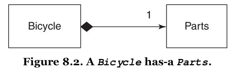
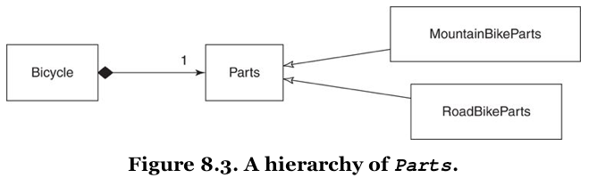
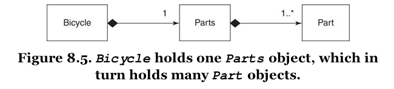

[&lt;&lt; Back to the README](README.md)

# Chapter 8. Combining Objects with Composition

Music *contains* notes, however, it is *not* the notes. It is something more.

You can create software this same way, by using object-oriented composition to
combine simple, independent objects into larger, more complex wholes. In
composition, the larger object is connected to its parts via a **has-a**
relationship.

Inherent in the definition of composition is the idea that, not only does
a bicycle have parts, but it communicates with them via an interface. Part
is a *role* and bicycles are happy to collaborate with any object that plays
the role.

## Composing a Bicycle of Parts

This chapter takes off with code from the end of Chapter 6 - refresh your
brain if you need. :smile:

### Updating the Bicycle Class

The abstract superclass in an inheritance hierarchy can be converted to use
composition. Step 1 is to ignore the existing code and think about how
a bicycle should be composed.

An object can represent a collection of items, not just a single one. A `Parts`
object, for example, that holds `spares`.

Every `Bicycle` needs a `Parts` object; part of what it means to be a `Bicycle`
is to **have-a** `Parts`.



The diagram shows the `Bicycle` and `Parts` classes connected by a line. The line
attaches to `Bicycle` with a black diamond; this black diamond indicates
**composition**, it means that a `Bicycle` is composed of `Parts`. The `Parts`
side has the number "1", meaning that there is just one `Parts` object per
`Bicycle`.

To update the `Bicycle` code, remove most of its code, add a `parts` variable to
hold the `Parts` object, and delegate `spares` to `parts.spares`.

This makes `Bicycle` responsible for three things:

1. knowing its `size`
2. holding onto its `Parts`
3. Answering its `spares`

### Creating a Parts Hierarchy

You can then create a hierarchy for the **has-a** relationship, so that `Parts`
is the abstract superclass for `RoadBikeParts` and `MountainBikeParts`.



Whether a `Bicycle` has `MountainBikeParts` or `RoadBikeParts`, it can still
correctly answer the `size` and `spares` messages.

## Composing the Parts Object

Choosing to create an individual `Part` object to go along with the `Parts`
object makes good sense but can make conversation a challenge. When using the
singular, use the word *object* after, and pluralize as necessary.

You could also choose other names, but this is a common occurrence and other
names may not be as expressive.

So a `Parts` object may contain many `Part` objects.

### Creating a Part



The notation near the `Part` as '1..(asterisk)' indicates that a `Parts` will
have one or more `Part` objects.

At this point, the `Parts` object becomes a simple wrapper around an array of
`Part` objects.

```ruby
chain = Part.new(name: 'chain', description: '10 speed')

road_bike_parts = Parts.new(parts:[chain, road_tire, tape])
```

You can also create the `Parts` object when initializing the `Bicycle`.

While it may be tempting to think of these objects as intances of `Part`,
composition tells you to think of them as objects that play the `Part` role.
They do not have to be a **kind-of** the `Part` class, they just have to act
like one; that is, they must respond to `name`, `description`, and `needs_spare`.

### Making the Parts Object More Like an Array

The `Parts` object does **not** behave like an array and all attempts to treat
it as one will fail.

You could add a `size` method, however, this change starts the `Parts` class down
a slippery slope. Soon, you'll want it to respond to `each`, then `sort`, and
other `Array` messages. The more array-like you make `Parts`, the more like it
you will need it to be.

You could subclass `Parts` as inheriting from `Array`, but also inherits the
addition message from `Array`, as well as all the rest of the public interface,
and this can wreck havoc unexpectedly down the line.

Somewhere in the middle ground between complexity and usability lies the
following solution. The `Parts` class delegates `size` and `each` to the `@parts`
array and includes `Enumerable` to get common traversal and searching methods.

## Manufacturing Parts

Everything would be easier if you could describe the different bikes and then use
your descriptions to magically manufacture the correct `Parts` object for any
bike.

It is easy to describe the combination of parts that make up a specific bike.

The manner in which it makes sense to you is a good sense that maybe using a
factory could help make life even easier, and the code, more expressive.

### Creating the PartsFactory

An object that manufactures other objects is a factory, per chapter 3. 

The word **factory** does not mean difficult or contrived or overly complicated;
it's merely the word OO designers use to concisely communicate the idea of an
object that creates other objects. **Ruby factories are simple and there is no
reason to avoid this intention revealing word.**

Putting knowledge of the configuration structure in a factory has two consequences.
First, the config can be expressed very tersley. Second, once you commit to
keeping the config structure in an array, you should **always** use the factory
to generate new items.

### Leveraging the PartsFactory

Once a factory is up and running, it might take a lot of the burden off from
the object it generates. In the instance of the `Part` class, it can actually
be reduced to an `OpenStruct` instead of a class.

`OpenStruct` is a lot like the `Struct` class, as it provides a convenient way
to bundle a number of attributes into an object. `Struct` differs because it
takes position order initialization while `OpenStruct` takes a hash and then
derives attributes appropriately.

Remember that the `Part` is a role, and removing the class and using an
`OpenStruct` shouldn't bother you. You can actually have the `OpenStruct` be
part of the code that the message uses, instead of being a standalone class.

## The Composed Bicycle

`Bicycle` **has-a** `Parts`, which in turn **has-a** collection of `Part`
objects. `Parts` and `Part` may exists as classes, but the objects in which
they are contained think of them as roles. `Parts` is a class that plays the
`Parts` role; it implements `spares`. The role of `Part` is played by an
`OpenStruct`, which implements `name`, `description`, and `needs_spare`.

**Aggregation is exactly like composition except that the contained object has
an independent life.**

## Deciding Between Inheritance and Composition

For the cost of arranging objects in a hierarchy, you get message delegation
for free.

Composition allows objects to have structural independence, but at the cost of
explicit message delegation.

The general rule is that, faced with a problem that composition can solve,
you should be biased towards doing so. If you cannot explicitly defend inheritance
as a better solution, use composition. It contains far fewer built-in dependencies
than inheritance; it is very often the best choice.

Inheritance *is* a better solution when its use provides high reward for low
risk.

### Accepting the Consequences of Inheritance

#### Benefits of Inheritance

Remeber the **T**ransparent, **Reasonable**, **Usable**, and **Exemplary** goals
of code. Inheritance can excel at except the first of those.

Correctly modeled hiarachies are extremely reasonable; big changes in behavior
can be achieved via small changes in code.

Hierarchies are thus usable; you can easily create new subclasses to accommodate
new variants.

Hierarchies are therefore exemplary; by their nature they provide guidance for
writing the code to extend them.

#### Costs of Inheritance

You might be fooled into choosing inheritance to solve the wrong kind of problem.
Because the model is incorrect, the behavior you may need to add won't fit; in
this case you'll be forced to duplicate or restructure code.

You could also be writing code that will be used by others for purposes you did
not anticipate. They may want the behavior you have created but may not want
the dependencies that inheritance demands.

If you apply inheritance to a problem for which it is not suited, you get the
opposite of the **reasonable**, **usable** and **exemplary** coins.

Small changes could break everything, making it **unreasonable**.

You may not be able to reuse existing behavior without changing it, making it
**unusable**.

Inadequate hierarchies should not be extended, they need to be refactored, but
you may not have the skill to do so. You may be forced to duplicate existing
code or to add dependencies on class names, both of which serve to exacerbate
existing design problems.

**Inheritance by definition comes with a deeply embedded set of dependencies.**

"What will happen if I am wrong?" assumes special importance. Classical inheritance
is both strong and weak; subclasses are bound, irrevocably and by design, to the
classes above them in the hierarchy. 

Your audience also matters here. It might be wise if you  are writing code for
an in-house application with which you are intimately familiar. However, if you
write code for a wider audience, anticipating the needs becomes harder and the
suitability of requiring inheritance as part of the interface goes down.

Avoid writing frameworks that require users of your code to subclass your objects
in order to gain your behavior. Their application's objects may already be
arranged in a hierarchy; inheriting from your framework may not be possible.

### Accepting the Consequences of Composition

Composed objects do not depend on the structure of the class hierarchy, and they
delegate their own messages.

#### Benefits of Composition

Small objects that have a single responsibility are **transparent**; easy to
understand the code and it's clear what will happen if it changes.

From the point of view of the composed object, adding a new variant of an
existing part is **reasonable** and requires no changes to its code.

Well-composed objects are therefore easily **usable** in new and unexpected
contexts.

At best, composition results in applications built of simple, pluggable objects
that are easy to extend and have a high tolerance for change.

#### Costs of Composition

While every individual part may indeed be transparent, the whole may not be.

Identical delegation code may be needed by many different objects; composition
has no way to share this code.

Composition is excellent as prescribing rules for assembling an object made of
parts but doesn't provide as much help for the problem of arranging code for a
collection of parts that are very nearly identical.

### Choosing Relationships

The trick to lowering your application costs is to apply each technique to the
right problem. 

- "Inhertiance is specialization."
- "Inheritance is best suited to adding functionality to existing classes when
   you will use most of the old code and add relatively small amounts of new
   code."
- "Use composition when the behavior is more than the sum of its parts."

#### Use Inheritance for is-a Relationships

Small sets of real-world objects that fall naturally into static, transparently
obvious specialization hierarchies are candidates to be modeled using classical
inheritance.

If you have  six different shocks, almost all identical, you can see that each
is-a shock.

If modeling a bevy of new shocks requires dramatically expanding the hierarchy,
or if the new shocks don't conveniently fit into the existing code, reconsider
alternatives **at that time.**

#### Use Duck Types for behaves-like-a Relationships

For problems that require many different objects to play a common role, duck
types are the likely candidate. For *scheduable, preparable, printable, etc*.

A bicycle **behaves-like-a** scheduable but it **is-a bicycle**. Also, the need
is widespread; many otherwise unrelated objects share a desire to play the same
role.

Think about roles from the outside. The holder of a *schedulable* expects it to
implement `Schedulable`'s interface and to honor `Schedulable`'s contract. All
*schedulabless* are alike in that they must meet these expectations.

You need to recognize that a role exists, define the interface of its duck type
and provide an implementation of that interface for every possible player. Some
roles consist only of their interface, others share common behavior. Define the
common behavior in a Ruby module to allow objects to play the role without
duplicating the code.

#### Use Composition for has-a Relationships

Many objects contain numerous parts but are more than the sum of those parts.
`Bicycles` **have-a** `Parts`, but the bike itself is something more. Given
the current requirements of the bicycle example, the most cost-effective way to
model the `Bicycle` object is via composition.

This **is-a** versus **has-a** distinction is at the core of deciding between
inheritance and composition. The more parts an object has, the more likely it
should be modeled with composition. For every problem, assess the costs and
benefits of alternative design techniques and use your judgement and experience
to make the best choice.

## Summary

Learning to use these techniques properly is a matter of experience and judgement,
and one of the best ways to gain experience is to learn from your own mistakes.

The key to improving your design skills is to attempt these techniques, accept
your errors cheerfully, remain detached from past design decisions, and refactor
mercilessly.
