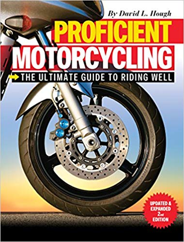

[🔙 🏡](../README.md)

# Proficient Motorcycling - The Ultimate Guide to Riding Well (2013)

By the awesome [David L. Hough](https://en.wikipedia.org/wiki/David_L._Hough)

## Links:

- [Purchase Proficient Motorcycling - The Ultimate Guide to Riding Well](https://www.amazon.com/Proficient-Motorcycling-Ultimate-Guide-Riding/dp/1620081199)

## Chapter Notes:

    - [Chapter 1. RISK!](ch01-risk.md)
    - [Chapter 2. Motorcycle Dynamics](ch02-motorcycle-dynamics.md)
    - [Chapter 3. Cornering Tactics](ch03-cornering-tactics.md)
    - [Chapter 4. Urban Traffic Survival](ch04-urban-traffic-survival.md)
    - [Chapter 5. Booby Traps](ch05-booby-traps.md)
    - [Chapter 6. Special Situations](ch06-special-situations.md)
    - [Chapter 7. Sharing the Ride](ch07-sharing-the-ride.md)

