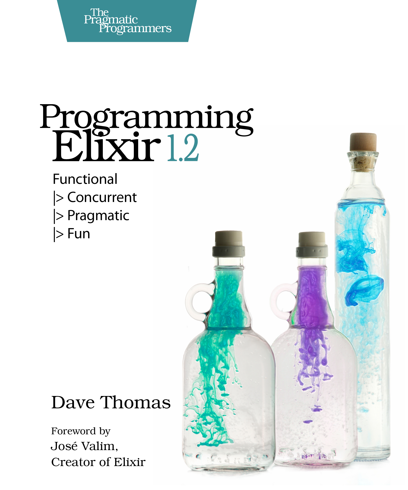

[&lt;&lt; Back to project home](../../README.md)

# Programming Elixir 1.2

By the howling [Dave Thomas](https://pragdave.me/)

## Links:

- [Purchase](https://pragprog.com/book/elixir12/programming-elixir-1-2)
- [Elixir Style Guide](https://github.com/niftyn8/elixir_style_guide)

## Chapter Notes:

- [Chapter 1. Take the Red Pill](ch01-take-the-red-pill.md)
- **Part 1: Conventional Programming**
  - [Chapter 2. Pattern Matching](ch02-pattern-matching.md)
  - [Chapter 3. Immutability](ch03-immutability.md)
  - [Chapter 4. Elixir Basics](ch04-elixir-basics.md)
  - [Chapter 5. Anonymous Functions](ch05-anonymous-functions.md)
  - [Chapter 6. Modules and Named Functions](ch06-modules-and-named-functions.md)
  - [Chapter 7. Lists and Recursion](ch07-lists-and-recursion.md)
  - [Chapter 8. Maps, Keyword Lists, Sets and Structs](ch08-maps-keyword-lists-sets-and-structs.md)
  - [Chapter 9. An Aside - What Are Types?](ch09-an-aside-what-are-types.md)
  - [Chapter 10. Processing Collections - Enum and Stream](ch10-processing-collections-enum-and-stream.md)
- **Part 2: Concurrent Programming**
  - [Chapter 11. Strings and Binaries](ch11-strings-and-binaries.md)
  - [Chapter 12. Control Flow](ch12-control-flow.md)
  - [Chapter 13. Organizing a Project](ch13-organizing-a-project.md)
  - [Chapter 14. Working with Multiple Processes](ch14-working-with-multiple-processes.md)
  - [Chapter 15. Nodes - The Key to Distributing Services](ch15-nodes-the-key-to-distributing-services.md)
  - [Chapter 16. OTP - Servers](ch16-otp-servers.md)
  - [Chapter 17. OTP - Supervisors](ch17-otp-supervisors.md)
  - [Chapter 18. OTP - Applications](ch18-otp-applications.md)
  - [Chapter 19. Tasks and Agents](ch19-tasks-and-agents.md)
- **Part 3: More Advanced Elixir**
  - [Chapter 20. Macros and Code Evaluation](ch20-macros-and-code-evaluation.md)
  - [Chapter 21. Linking Modules - Behaviours and Use](ch21-linking-modules-behaviours-and-use.md)
  - [Chapter 22. Protocols - Polymorphic Functions](ch22-protocols-polymorphic-functions.md)
  - [Chapter 23. More Cool Stuff](ch23-more-cool-stuff.md)

