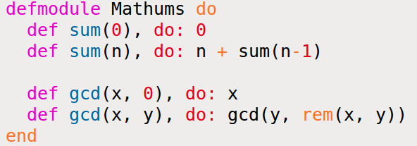

[&lt;&lt; Back to the README](README.md)

# Chapter 6. Modules and Named Functions

Once an app grows beyond a few lines, it ought to be structured. You do this by
creating *named functions* and organize these into **modules**. The prior
**have to be** written inside the latter.

```elixir
defmodule Times do
  def double(n) do
    n * 2
  end
end
```

A module named `Times` with a single fn, `double`. You will see this fn written
as `double/1`.

## Compiling a Module

You can compile this in two different manners:

```
iex times.exs
Times.double 4
#=> 8
```

Give iex a source file's name, and it compiles and loads the file before the
first prompt.

If you are already in iex, you can use the `c` helper to compile your file w/o
returning to the command line.

```elixir
c "times.exs"
#=> [Times]
Times.double(4)
#=> 8
```

The line `c "times.exs" compiles the source file and loads it into iex.

## The Function's Body Is a Block

The `do...end` block is one way of grouping expressions. However, `do...end` is
not the real syntax, it's actually:

```elixir
def doubl(n), do: n * 2
```

You can pass multiple lines to `do:` by grouping them with parens.

```elixir
def greet(greeting, name), do: (
  IO.puts greeting
  IO.puts "How are you doing, #{name}?"
)
```

The `do...end` is just a lump of syntactic sugar. It's actually just compiled
into the `do:` form. Generally, `do:` is used for single-line blocks, and
`do...end` is used for multiline ones.

So that `times` example would likely be:

```elixir
defmodule Times do
  def double(n), do: n * 2
end
```

It could even be more abridged by putting it all on a single line, but that is
only a headache for readers.

## Your Turn

1. Extend the `Times` module with a `triple` fn that multiples its params by 3.
2. Run the above result in iex and use both techniques to compile the file.
3. Add a `quadruple` function, and call the `double` fn from inside.

```elixir
defmodule Times
  def double(n), do: n * 2
  def triple(n), do: n * 3
  def quadruple(n), do: double(n) * 2
end
```

## Function Calls and Pattern Matching

When writing anon fns, pattern matching was done in a very `case`-ish manner.
With named fns, we move into writing the fn multiple times, each with its own
param list and body.

Think of the factorial of *n*, (written *n!*). If the factorial of 0 is checked
it is considered 1, the others have there own result. Elixir makes this simple.

```elixir
defmodule Factorial do
  def of(0), do: 1
  def of(n), do: n * of(n-1)
end
```

Here we have two definitions of the same fn, and it will try them in the order
they are defined, as long as the arity matches.

Tail recursion will help us improve this code later on. For now, let's play.

```elixir
c "factorial1.exs"
Factorial.of(3)
#=> 6
Factorial.of(7)
#=> 5040
Factorial.of(10)
#=> 3628800
Factorial.of(1000)
#=> 402387260077093...00000000
```

The one point worth stressing is the order of the clauses can make a difference
when you translate them into code. It tries fn from the top down, executing the
first match.

SO don't do the following:

```elixir
defmodule Badfactorial do
  def of(n), do: n * of(n-1)
  def of(0), do: 1
end
```

The first will always match and the second will never be called. You will get
an error when attempting to compile this code, though.

Finally, make sure that multiple fn defs with the same name should be adjacent
in the source file.

## Your Turn

1. Implement and run a function `sum(n` that uses recursion to calculate the
   sum of integers from 1 to *n*.
2. Write a function `gcd(x,y)` that finds the greatest common divisor between
   two positive integers. And if `y` is zero, the return value should be `x`.
   Otherwise, it's `gcd(y, rem(x, y))`.

Solutions:


