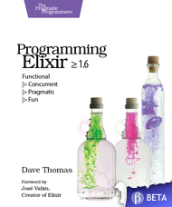

[🔙 🏡](../README.md)

# Programming Elixir 1.6 (2018)

By the unbelievable [Dave Thomas](https://pragprog.com/book/elixir16/programming-elixir-1-6)

## Links:

- [Purchase Programming Elixir 1.6](https://pragprog.com/book/elixir16/programming-elixir-1-6)

## Chapter Notes:

    - [Chapter 1. Take the Red Pill](ch01-take-the-red-pill.md)
02. **Part I. Conventional Programming**
    - [Chapter 2. Pattern Matching](ch02-pattern-matching.md)
    - [Chapter 3. Immutability](ch03-immutability.md)
    - [Chapter 4. Elixir Basics](ch04-elixir-basics.md)
    - [Chapter 5. Anonymous Functions](ch05-anonymous-functions.md)
    - [Chapter 6. Modules and Named Functions](ch06-modules-and-named-functions.md)
    - [Chapter 7. Maps, Keyword Lists, Sets, and Structs](ch07-maps-keyword-lists-sets-and-structs.md)
    - [Chapter 8. An Aside -- What Are Types?](ch08-an-aside-what-are-types.md)
    - [Chapter 9. Processing Collections - Enum and Stream](ch09-processing-collections-enum-and-stream.md)
    - [Chapter 10. Strings and Binaries](ch10-strings-and-binaries.md)
    - [Chapter 11. Control Flow](ch11-control-flow.md)
    - [Chapter 12. Organizing a Project](ch12-organizing-a-project.md)
    - [Chapter 13. Tooling](ch13-tooling.md)
03. **Part II. Concurrent Programming**
    - [Chapter 14. Working with Multiple Processes](ch14-working-with-multiple-processes.md)
    - [Chapter 15. Nodes - The to Distributing Services](ch15-nodes-the-to-distributing-services.md)
    - [Chapter 16. OTP: Servers](ch16-otp-servers.md)
    - [Chapter 17. OTP: Supervisors](ch17-otp-supervisors.md)
    - [Chapter 18. A More Complex Example](ch18-a-more-complex-example.md)
    - [Chapter 19. OTP: Applications](ch19-otp-applications.md)
    - [Chapter 20. Tasks and Agents](ch20-tasks-and-agents.md)
04. **Part III. More Advanced Elixir**
    - [Chapter 21. Macros and Code Evaluation](ch21-macros-and-code-evaluation.md)
    - [Chapter 22. Linking Modules: Behavio(u)rs and Use](ch22-linking-modules-behavio-u-rs-and-use.md)
    - [Chapter 23. Protocols -- Polymorphic Functions](ch23-protocols-polymorphic-functions.md)
    - [Chapter 24. More Cool Stuff](ch24-more-cool-stuff.md)
05. **Appendices**
    - [Appendix 1. Exceptions: Raise and Try, Catch, and Throw](ap01-exceptions-raise-and-try-catch-and-throw.md)
    - [Appendix 2. Type Specifications and Type Checking](ap02-type-specifications-and-type-checking.md)

