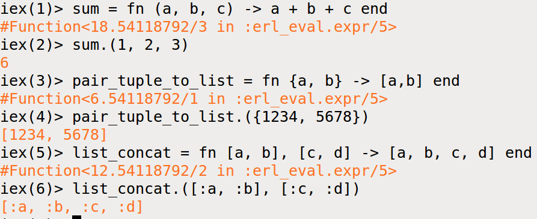
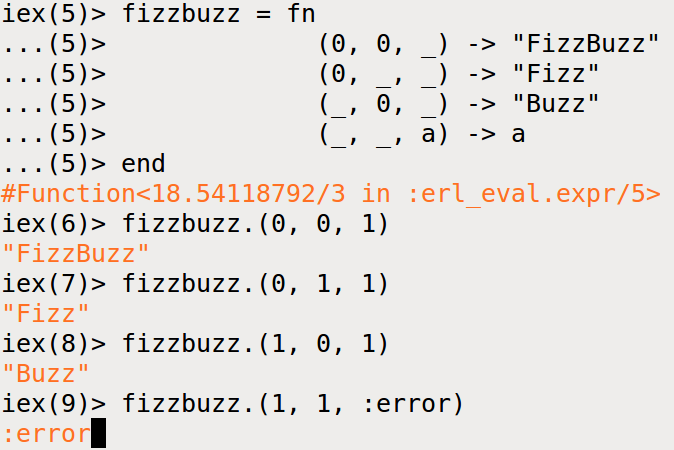

[&lt;&lt; Back to the README](README.md)

# Chapter 5. Anonymous Functions

Functions are a basic type in this functional language. You can create an anon
function using the `fn` keyword.

```elixir
fn
  parameter-list -> body
  parameter-list -> body ...
end
```

Think of `fn...end` as being like the quotes that surround a string literal,
except we're instead returning a function as a value (kind of like in
JavaScript and CoffeeScript). So we can also invoke it, and pass in args.

So the simplest form is a param list and a body, separated by `->`.

```elixir
sum = fn (a, b) -> a + b end
#=> Function<12.17052888 in :erl_val.expr/5>

sum.(1, 2)
#=> 3
```

Two invoke the function, the dot (`.`) is used, and the args are passed as
normal args would be.

Even if your function takes no args, you still need the parens to call it. But
you don't need the parens when defining the function.

```elixir
sum = fn a, b -> a + b end
#=> Function<12.17052888 in :erl_val.expr/5>

sum.(1, 2)
#=> 3

f2 = fn -> 99 end
#=> Function<12.17052888 in :erl_val.expr/5>

f2.()
#=> 99
```

## Functions and Pattern Matching

When we call `sum.(2,3)`, it's easy to assume we simply assign 2 to the param
`a` and `3` to be, but we're in a functional lang with immutable vars. Elixir
doesn't have assignment, it tries to match values to patters.

If we write `a = 2`, the Elixir makes the pattern match by binding `a` to the
value of `2`, which is what happens when our `sum` fn gets called. We pass `2`
and `3` as args, and Elixir tries to match them to the params `a` and `b`. It
would be the same if we wrote `{a, b} = {1, 2}`.

This means we can perform a more complex pattern match when we call a fn. For
example, the following fn reverses the order of elements in a two-element
tuple:

```elixir
swap = fn {a, b} -> {b, a} end
swap.({6, 8})
#=> {8, 6}
```

*Notice that the fn def has the variables in braces, as well as how they are
passed in. It looks like we can expect a tuple match on passing to be able to
work with the values inside the tuple without any extra magic.*

## Your Turn

Create functions in iex that will perform the following:

```elixir
list_concat.([:a, :b], [:c, :d])
#=> [:a, :b, :c, :d]
sum.(1, 2, 3)
#=> 6
pair_tuple_to_list.({1234, 5678})
#=> [1234, 5678]
```

My solutions:



## One Function, Multiple Bodies

A single fn def lets you define diff implementations, depending on the type and
contents of the args passed.

At its simplest, we can use pattern matching to select which clause to run. If
`File.open` has `:ok` as its first element when successfully opened, we can
write a fn that displays either the first line of said file or a simple error
message.

```elixir
handle_open = fn
                {:ok, file}  -> "Read data: #{IO.read(file, :line)}"
                {_,   error} -> "Error: #{:file.format_error(error)}"
              end

handle_open.(File.open("code/path"))
```

You'll notice that now, depending on what happens in the `File.open` call, a
different fn arg set gets matched on, changing the execution of the fn
altogether.

Also note that `:file.format_error` refers to the underlying Erlang `File`
module, so we can call its `format_error` fn.

## Working with Larger Code Examples

Remember that you can write out an `.exs` file and then load it into iex, and
iex will execute it and it's entirety. To do this, you must use the `c` fn, a
fn that compiles and runs the code in the given file.

```elixir
c "elixir_file.exs"
```

We can also run that file directly from the command line.

```sh
elxiir elixir_file.exs
```

Remember that `.exs` is used for source and script files, and `.ex` is used for
files we will want to compile and use later.

## Your Turn

Write a FizzBuzz fn that returns "FizzBuzz" if both args are zero, "Fizz" if
only the first is, and "Buzz" if only the second is. Return the third arg when
neither is zero.

Solution:



The operator `rem(a, b)` returns the remainder after dividing `a` by `b`.
Write a fn that takes a single integer (`n`), and calls the function from the
above exercise, passing it `rem(n, 3)`, `rem(n, 5)`, and `n`. Call it seven
times with arguments `10..16`. Expected output should be "Buzz, 11, Fizz, 13,
14, FizzBuzz, 16".

*And when you are complete, you will have written a FizzBuzz solution without
any conditional logic.*

Solution:


## Functions Can Return Functions

```elixir
fun1 = fn -> fn -> "Hello" end end
fun1.()
fun.().()
#=> "Hello"
```

If you spread of the fn def, then it's a bit easier to read.

We may call the outer fn and bind the result to a separate var, We might also
use parens to make the inner fn more obvious.

### Functions Remember Their Original Environment

Deeper we go:

```elixir
greeter = fn name -> (fn -> "Hello #{name}" end) end
dave_greeter = greeter.("Dave")
dave_greeter.()
#=> "Hello Dave"
```

So the `name` parame is available throughout the body of the fn, even in the
inner fn.

The inner fn uses the outer fn's `name` param. Why does this happen/work?
Because Elixir fn's automatically carry with them the bindings of vars in the
scope in which they are defined. The var `name` is bound in the scope of the
outer fn, and when the inner fn is defined, it inherits this scope and carries
the binding of `name` with it. This is considered a **closure**; the scope
encloses the bindings of its vars, packaging them into something th can be
saved and used later.

### Parameterized Functions

What if both fn's took args?

```elixir
add_n = fn n -> (fn other -> n + other end) end
add_two = add_n.(2)
add_two.(3)
#=> 5
add_five = add_n.(5)
add_five.(7)
#=> 12
```

The inner fn adds the value of its param `other` to the value of the outer fn's
param `n`. Each time we call the outer fn, we give it a value for `n` and it
returns a fn that adds `n` to its own param.

So `add_two = add_n.(2)` binds a fn that accepts an `other` param.

## Your Turn

Write a fn `prefix` that takes a string. It should return a new fn that takes
a second string. When the second fn is called, it will return a string that
contains the first string, a space, and the second string.

```elxir
mrs = prefix.("Mrs")
mrs.("Smith")
#=> "Mrs Smith"
prefix.("Elixir").("Rocks")
#=> "Elixir Rocks"
```

Solution:


## Passing Functions As Arguments

If fns are just values, we should be able to pass them to other fns. We can.

```elixir
times_2 = fn n -> n * 2 end
apply = fn (fun, value) -> fun.(value) end
apply.(times_2, 6)
#=> 12
```

In this example, `apply` is a fn that takes a second fn and a val. It returns
the result of invoking that second fn with the val as an arg.

We use this ability to pass fn around everywhere in Elixir code. The built-in
`Enum` module has a fn called `map` that takes two args: a collection, and a
fn. It returns a list that is the result of applying that fn to each element
of the collection.

```elixir
list = [1, 3, 5, 7, 9]
Enum.map list, fn ->elem -> elem * 2 end
#=> [2, 6, 10, 14, 18]
Enum.map list, fn elem -> elem > 6 end
#=> [false, false, false, true, true]
```

### Pinned Values and Function Parameters

Remember that pin operator (`^`) we talked about, which let us use the current
val of a var in a pattern? You can use this with fn params, as well.

```elixir
defmodule Greeter do

  def for(name, greeting) do
    fn
      (^name) -> "#{greeting} #{name}"
      (_)     -> "Who are you?"
    end
  end

end

mr_john = Greeter.for("John", "Doe")

IO.puts mr_john.("John")  #=> "Heya John"
IO.puts mr_john.("Dave")  #=> "Who are you?"
```

In this example, the `Greeter.for` fn returns a fn with two heads. The first
matches when the first param is the value of the name passed to `for`.

### The & Notation

Let's make defining fns so easy.

```elixir
add_one = &(&1 + 1)  # same as add_one = fn (n) -> n + 1 end
add_one.(44)
#=> 45
square = &(&1 * &1)
square.(8)
#=> 64
speak = &(IO.puts(&1))
speak.("Hello")
#=> Hello
:ok
```

The `&` operator converts the expression that follows into a function. Inside
that expression, the placeholders `&1`, `&2`, etc, correspond to the params of
the fn.

Elixir is even more clever. The `speak` line in the previous code would create
an anon fn, but Elixir noticed that the body was simply a call to a named fn
(IO fn `puts`) and the params were correct, so it optimized away the anon fn
and created a direct reference to the fn, `IO.puts/1`.

Keep in mind the args must be in the correct order for Elixir to be able to
optimize this way.

Because `[]` and `{}` are operators on Elixir, they can also be turned into
fns.

```elixir
divrem = &{ div(&1, &2), rem(&1, &2) }
divrem.(13, 5)
#=> {2, 3}
```

There is also a second form of the `&` fn capture operator. You can give it the
name and arity (num of params) of an existing fn and it will return an anon fn
that calls it.

```elixir
l = &length/1
l.([1, 2, 3, 4])
#=> 4

len = &Enum.count/1
len.([1, 2, 3, 4])
#=> 4

m = &Kernel.min/2  #Erlang fn being aliased
m.(99, 88)
#=> 88
```

We can also do that for named fns we write, as well.

The `&` shortcut gives us a wonderful way to pass fns to other fns.

```elixir
Enum.map [1, 2, 3, 4], &(&1 + 1)
#=> [2, 3, 4, 5]
```

## Your Turn

Use the `&...` notation to rewrite the following:

```elixir
Enum.map [1, 2, 3, 4], fn x -> x + 2

#solution
Enum.map [1, 2, 3, 4, &(&1 + 2)


Enum.each [1, 2, 3, 4], fn x -> IO.inspect x end

#solution
Enum.each [1, 2, 3, 4], &IO.inspect/1
```

## Functions Are the Core

The basis of programming is transforming data, and functions are the little
engines that perform that transformation.

Up next is working with named functions, not just anon fns bound to vars.
