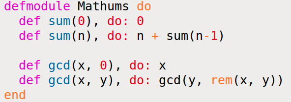

[&lt;&lt; Back to the README](README.md)

# Chapter 6. Modules and Named Functions

Once an app grows beyond a few lines, it ought to be structured. You do this by
creating *named functions* and organize these into **modules**. The prior
**have to be** written inside the latter.

```elixir
defmodule Times do
  def double(n) do
    n * 2
  end
end
```

A module named `Times` with a single fn, `double`. You will see this fn written
as `double/1`.

## Compiling a Module

You can compile this in two different manners:

```
iex times.exs
Times.double 4
#=> 8
```

Give iex a source file's name, and it compiles and loads the file before the
first prompt.

If you are already in iex, you can use the `c` helper to compile your file w/o
returning to the command line.

```elixir
c "times.exs"
#=> [Times]
Times.double(4)
#=> 8
```

The line `c "times.exs" compiles the source file and loads it into iex.

## The Function's Body Is a Block

The `do...end` block is one way of grouping expressions. However, `do...end` is
not the real syntax, it's actually:

```elixir
def doubl(n), do: n * 2
```

You can pass multiple lines to `do:` by grouping them with parens.

```elixir
def greet(greeting, name), do: (
  IO.puts greeting
  IO.puts "How are you doing, #{name}?"
)
```

The `do...end` is just a lump of syntactic sugar. It's actually just compiled
into the `do:` form. Generally, `do:` is used for single-line blocks, and
`do...end` is used for multiline ones.

So that `times` example would likely be:

```elixir
defmodule Times do
  def double(n), do: n * 2
end
```

It could even be more abridged by putting it all on a single line, but that is
only a headache for readers.

## Your Turn

1. Extend the `Times` module with a `triple` fn that multiples its params by 3.
2. Run the above result in iex and use both techniques to compile the file.
3. Add a `quadruple` function, and call the `double` fn from inside.

```elixir
defmodule Times
  def double(n), do: n * 2
  def triple(n), do: n * 3
  def quadruple(n), do: double(n) * 2
end
```

## Function Calls and Pattern Matching

When writing anon fns, pattern matching was done in a very `case`-ish manner.
With named fns, we move into writing the fn multiple times, each with its own
param list and body.

Think of the factorial of *n*, (written *n!*). If the factorial of 0 is checked
it is considered 1, the others have there own result. Elixir makes this simple.

```elixir
defmodule Factorial do
  def of(0), do: 1
  def of(n), do: n * of(n-1)
end
```

Here we have two definitions of the same fn, and it will try them in the order
they are defined, as long as the arity matches.

Tail recursion will help us improve this code later on. For now, let's play.

```elixir
c "factorial1.exs"
Factorial.of(3)
#=> 6
Factorial.of(7)
#=> 5040
Factorial.of(10)
#=> 3628800
Factorial.of(1000)
#=> 402387260077093...00000000
```

The one point worth stressing is the order of the clauses can make a difference
when you translate them into code. It tries fn from the top down, executing the
first match.

So don't do the following:

```elixir
defmodule Badfactorial do
  def of(n), do: n * of(n-1)
  def of(0), do: 1
end
```

The first will always match and the second will never be called. You will get
an error when attempting to compile this code, though.

Finally, make sure that multiple fn defs with the same name should be adjacent
in the source file.

## Your Turn

1. Implement and run a function `sum(n` that uses recursion to calculate the
   sum of integers from 1 to *n*.
2. Write a function `gcd(x,y)` that finds the greatest common divisor between
   two positive integers. And if `y` is zero, the return value should be `x`.
   Otherwise, it's `gcd(y, rem(x, y))`.

Solutions:



## Guard Clauses

Guard clauses allow you to distinquish pattern matching based on types, or a
test involving the param's value.

```elixir
defmodule Guard do
  def what_is(x) when is_number(x) do
    IO.puts "#{x} is a number"
  end
  def what_is(x) when is_list(x) do
    IO.puts "#{inspect(x)} is a list"
  end
  def what_is(x) when is_atom(x) do
    IO.puts "#{x} is an atom"
  end
end

Guard.what_is(99)         #=> 99 is a number
Guard.what_is(:cat)       #=> cat is an atom
Guard.what_is([1, 2, 3])  #=> [1, 2, 3] is a list
```

In the factorial example we did previously, if we passed in a negative number,
it would loop forever. 

```elixir
defmodule Factorial do
  def of(0), do: 1
  def of(n), do: n * of(n-1)
end
```

To fix this...

```elixir
defmodule Factorial do
  def of(0), do: 1
  def of(n) when n> 0 do
    n * of(n-1)
  end
end
```

Pattern matching won't find a fn to match against, and there will be an error
raised (FunctionClauseError).

### Guard-Clause Limitations

Only a certain subset of Elixir expressions in guard clauses. See the
[Getting Started Guide](http://elixir-lang.org/getting-started/case-cond-and-if.html#expressions-in-guard-clauses)

## Default Parameters

You define a default param with the `param \\ value` syntax, which changes how
pattern matching picks up your fn, as the number of required params is diff
than the number of allowed params. Params are matched left to right.

```elixir
defmodule Example do
  def func(p1, p2 \\ 2, p3 \\ 3, p4) do
    IO.inspect [p1, p2, p3, p4]
  end
end

Example.func("a", "b")            #=> ["a", 2, 3, "b"]
Example.func("a", "b", "c")       #=> ["a", "b", 3, "c"]
Example.func("a", "b", "c", "d")  #=> ["a", "b", "c", "d"]
```

Default args can behave surprisingly when Elixir does pattern matching:

```elixir
defmodule Example do
  def func(p1, p2 \\ 2, p3 \\ 3, p4) do
    IO.inspect [p1, p2, p3, p4]
  end

  def func(p1, p2) do
    IO.inspect [p1, p2]
  end
end
```

The above will not compile and provided a function conflict statement, as the
pattern matching would not know which fn to match to.

```elixir
defmodule DefaultParams1 do
  def func(p1, p2 \\ 132) do
    IO.inspect [p1, p2]
  end

  def func(p1, 99) do
    IP.puts "you said 99"
  end
end
```

The above will also have an issue compiling, complaing about needing a fn head
with the defaults.

```elixir
defmodule Params do
  def func(p1, p2 \\ 123)

  def func(p1, p2) when is_list(p1) do
    "You said #{p2} with a list"
  end

  def func(p1, p2) do
    "You passed in #{p1} and #{p2}"
  end
end


IO.puts Params.func(99)           # you passed in 99 and 123
IO.puts Params.func(99, "cat")    # you passed in 99 and cat
IO.puts Params.func([99])         # you said 123 with a list
IO.puts Params.func([99], "dog")  # you said dog with a list
```


## Your Turn

*I'm thinking of a number between 1 and 1000...*

Define a fn that will be `guess(actual, range)` where `range` is an Elixir
range.

Your ouutput should look similar to this:

```elixir
Chop.guess(273, 1..1000)
#=> Is it 500
#=> Is it 250
#=> Is it 375
#=> Is it 312
#=> Is it 281
#=> Is it 265
#=> Is it 273
#=> 273
```

Hints:

- Don't be afraid to implement helper fns
- The `div(a, b)` fn performs integer division
- Guard clauses are your friends
- Patterns can match the low and high parts of a range `(a..b=4.8)`

*Solution forthcoming - tired. You can see [solutions online](https://forums.pragprog.com/forums/322/topics/Exercise:%20ModulesAndFunctions-6)*

## Private Functions

The `defp` macro defines a private function - one that can only be called from
within the module that declares it.

You can also declare private fns with multiple heads, just like with `def`.
But they must all be private or public, not a mix thereof.

## The Amazing Pipe Operator: `|>`

The best for last? You got it.

Code exists like this:

```elixir
people = DB.find_customers
orders = Orders.for_customers(people)
tax    = sales_tax(orders, 2016)
filing = prepare_filing(tax)
```

And there is this smelly alternative:

```elixir
filing = prepare_filing(sales_tax(Orders.for_customers(DB.find_customers), 2013))
```

And those are the types of code that you use to get kids to eat their veggies.

In Elixir, you can just pipe it:

```elixir
filing = DB.find_customers
           |> Orders.for_customers
           |> sales_tax(2016)
           |> prepare_filing
```

The `|>` operator takes the result of the expression to its left and inserts
it as the first param of the fn to its right.

`val |> f(a, b)` is the same as calling `f(val, a, b)`.

And you can chaing items on the same line. **Always use parentheses around
fn params in pipelines.**

The key aspect of the pipe operator is that it lets you write code that can
closely follow your spec's form.

Programming is transforming data, and the `|>` operator makes that
transformation explicit.

## Modules

Modules provide namespaces for things you define, like named fns. They can
also contain macros, structs, protocols, etc.

Inside the module, the namespace isn't required to call another fn that the
same module encloses; this is only required from outside the module.

Nested modules just use more dots, and that's because a nested module isn't
really a thing, it's an alias for `defmodule ModuleTop.ModuleMiddle do`.

Also, it means that there is no relationship between the modules.

### Directives for Modules

A directive in a module takes effect from the place you wrote it until the end
of the module.

#### The `import` Directive

The `import` directive brings a modules fns and/or macros into the current
scope (like in Ruby).

The `import` syntaax is: `import Module [, only:|except: ]`

The second param lets you control which fn or macros are imported, with a list
of `name: arity` pairs. 

```elixir
import List, only: [ flatten: 1, duplicate: 2 ]
import List, only: :functions
import List, only: :macros
```

It is good to limit what you import to what you need.

#### The `alias` Directive

`alias` creates an alias for a module, to cut down on typing, etc.

```elixir
alias My.Other.Module.Parser, as: Parser
alias My.Other.Module.Runner, as: Runner

# same as above, as the last segment is used as the default 'as:'
alias My.Other.Module.Parser
alias My.Other.Module.Runner

# same as above, cuz Elixir
alias My.Other.Module.{Parser, Runner}
```

#### The `require` Directive

You `require` a module if you want to use any macros it defines. This ensures
the definitions are available when your code is compiled. We'll talk more about
it later.

## Module Attributes

Elixir modules each have metadata, and those are considerer *attributes* and are
identified by a name. You can access these attrs by prefixing the name with an
`@` sign. To set an attr, you use the syntax `@name value`. Also, these only
work at the top of a module. You can also define attrs inside fns.

```elixir
defmodule Example do
  @author "Dave Thomas"
  def get_author do
    @author
  end
end
IO.puts "Example was written by #{Example.get_author}"
```

These are not classic variables that you might be aware of (looking at you,
Ruby). When an fn calls them, they have the value of whatever was set when the
fn was defined. So use these for config and metadata only. They are much like
constants.

```elixir
defmodule Example do
  @attr "one"
  def first, do: @attr
  @attr "two"
  def second, do: @attr
end
IO.puts "#{Example.first} #{Example.second}"
#=> one two
```

## Module Names: Elixir, Erlang, and Atoms

Modules have names such as `String` or `PhotoAlbum`. We call fns in them using
calls like `String.length("abc")`.

Internally, though? Module names are just atoms. When you write a name starting
with an uppercase letter, like `IO`, Elixir converts it internally into an atom
called `Elixir.IO`.

```elixir
is_atom IO
#=> true
to_string IO
#=> "Elixir.IO"
:"Elixir.IO" === IO
#=> true
```

So a call to an fn in a module is really an atom followed by a dot, and then the
fn name. So we can actually do this:

```elixir
IO.puts 123
#=> 123
:"Elixir.IO".puts 123
#=> 123
```

## Calling a Function in an Erlang Library

Conventions for Erlang names are different. Vars start with an uppercase and
atoms are simple lowercase names. So the Erlang module `timer` is just called
`timer`, which, in Elixir, we would write as `:timer`. If you want to refer to
the `tc` fn in `timer`, you'd write `:timer.tc`.

We can use the Erlang `format` fn in the `io` module to output a floating-point
number in a three-char-wide field with a single decimal.

```elixir
:io.format("The number is ~3.1f~n", [5.678])
#=> The number is 5.7
#=> :ok
```

## Finding Libraries

The first place to look is for existing Elixir modules. You can see the docs for
the built-in ones on the website, and others are listed at
[hex.pm](http://hex.pm), and in various places on Github.

You can also look for a built-in Erlang lib or search the web. If you find a
custom Erlang module, you can use it in your app. But remember that Erlang docs
follow Erlang conventions, and there may be mental hurdles to overcome.
[There is help](http://elixir-lang.org/crash-course.html).

## Your Turn

Find the library fns to do the following, and then use each in iex.
[See official solutions](https://forums.pragprog.com/forums/322/topics/Exercise:%20ModulesAndFunctions-7)

1. Convert a float to a string with 2 decimal digits. (Erlang)
   - `:io.format/2`
2. Get the value of an os environment var. (Elixir)
   - `System.get_env/1`
3. Return the extension of a file name. (Elixir)
   - `Path.extname/1`
4. Return the process's current working directory. (Elixir)
   - `System.cwd/0`
5. Find a lib to convert a string containing JSON in Elixir data structures.
   - *?*
6. Execute a command in your OS shell.
   - `System.cmd/1`
