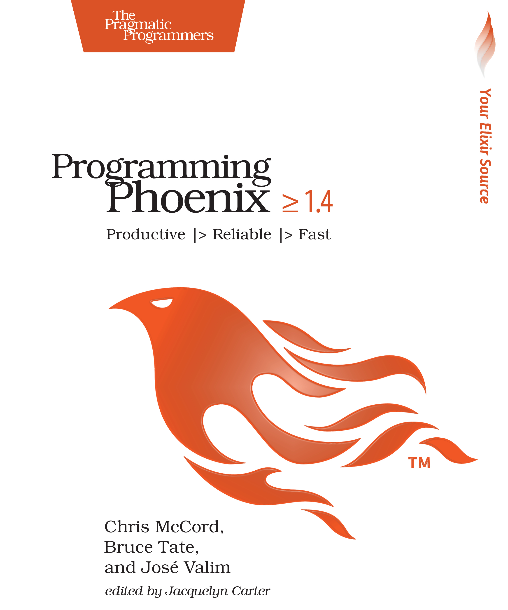

[🔙 🏡](../README.md)

# Programming Phoenix 1.4 (2018)

By the rattling [Chris McCord, Bruce Tate, and José Valim](https://pragprog.com/book/phoenix14/programming-phoenix-1-4)

## Links:

- [Purchase Programming Phoenix 1.4](https://pragprog.com/book/phoenix14/programming-phoenix-1-4)

## Chapter Notes:

- [Chapter 1. Introducing Phoenix](ch01-introducing-phoenix.md)
02. **Part I. Building with Functional MVC**
   - [Chapter 2. The Lay of the Land](ch02-the-lay-of-the-land.md)
   - [Chapter 3. Controllers](ch03-controllers.md)
   - [Chapter 4. Ecto and Changesets](ch04-ecto-and-changesets.md)
   - [Chapter 5. Authenticating Users](ch05-authenticating-users.md)
   - [Chapter 6. Generators and Relationships](ch06-generators-and-relationships.md)
   - [Chapter 7. Ecto Queries and Constraints](ch07-ecto-queries-and-constraints.md)
   - [Chapter 8. Testing MVC](ch08-testing-mvc.md)
03. **Part II. Writing Interactive and Maintainable Applications**
   - [Chapter 9. Watching Videos](ch09-watching-videos.md)
   - [Chapter 10. Using Channels](ch10-using-channels.md)
   - [Chapter 11. OTP](ch11-otp.md)
   - [Chapter 12. Observer and Umbrellas](ch12-observer-and-umbrellas.md)
   - [Chapter 13. Testing Channels and OTP](ch13-testing-channels-and-otp.md)
   - [Chapter 14. What's Next?](ch14-whats-next.md)

