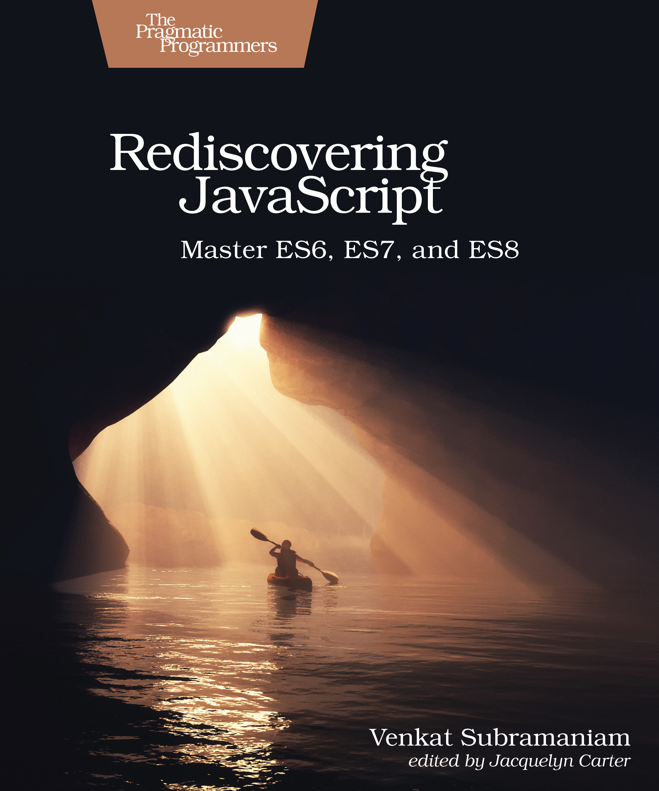

[🔙 🏡](../README.md)

# Rediscovering JavaScript (2018)

By the wondrous [Venkat Subramaniam](https://pragprog.com/book/ves6/rediscovering-javascript)

## Links:

- [Purchase Rediscovering JavaScript](https://pragprog.com/book/ves6/rediscovering-javascript)

## Chapter Notes:

[Chapter 0. Running Code](ch00-running-code.md)
01. **The Safe Alternatives**
  - [Chapter 1. JavaScript Gotchas](ch01-javascript-gotchas.md)
  - [Chapter 2. Variables and Constants](ch02-variables-and-constants.md)
  - [Chapter 3. Working with Function Arguments](ch03-working-with-function-arguments.md)
02. **Nice Additions**
  - [Chapter 4. Iterators and Symbols](ch04-iterators-and-symbols.md)
  - [Chapter 5. Arrow Functions and Functional Style](ch05-arrow-functions-and-functional-style.md)
  - [Chapter 6. Literals and Destructing](ch06-literals-and-destructing.md)
03. **OO and Modular Code**
  - [Chapter 7. Working with Classes](ch07-working-with-classes.md)
  - [Chapter 8. Using Inheritance](ch08-using-inheritance.md)
  - [Chapter 9. Using Modules](ch09-using-modules.md)
04. **Going Meta**
  - [Chapter 10. Keeping Your Promises](ch10-keeping-your-promises.md)
  - [Chapter 11. Exploring Metaprogramming](ch11-exploring-metaprogramming.md)
  - [Chapter 12. Deep Dive into Metaprogramming](ch12-deep-dive-into-metaprogramming.md)

