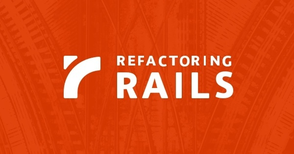

[🔙 🏡](../README.md)

# Refactoring Rails (2017)

By the awesome [Ben Orenstein](http://www.benorenstein.com/)

## Links:

- [Purchase Refactoring Rails](https://www.refactoringrails.io/)

## Chapter Notes:

- [Chapter 1. Use REST](ch01-use-rest.md)
- [Chapter 2. Callbacks](ch02-callbacks.md)
- [Chapter 3. Form Objects](ch03-form-objects.md)
- [Chapter 4. Page Objects](ch04-page-objects.md)
- [Chapter 5. Slow Tests](ch05-slow-tests.md)
- [Chapter 6. Tell, Don't Ask](ch06-tell-dont-ask.md)
- [Chapter 7. Testing Best Practices](ch07-testing-best-practices.md)
- [Chapter 8. Grab Bag](ch08-grab-bag.md)

