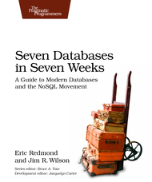

[&lt;&lt; Back to project home](../README.md)

# Seven Databases in Seven Weeks

I jump in and out of this book to learn stuff about data stores, and so this is
more of a sporadic read-through than anything else.

Notes:

- [Chapter 2. PostgresSQL](ch2-postgres-sql.md)
- [Chapter 8. Redis](ch8-redis.md)
- [Chapter 9. Wrapping Up (and making them work together)](ch9-wrapping-them-up-together.md)

