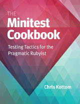

[&lt;&lt; Back to project home](../README.md)

# The Minitest Cookbook

By the tremendous [Chris Kottom](http://chriskottom.com/)

## Links:

- [Purchase The Minitest Cookbook](http://minitestcookbook.com)

## Chapter Notes:

- [Chapter 1. Introduction](ch01-introduction.md)
- [Chapter 2. How Minitest Works](ch02-how-minitest-works.md)
- [Chapter 3. Add Minitest to a Ruby Project](ch03-add-minitest-to-a-ruby-project.md)
- [Chapter 4. Running Your Tests](ch04-running-your-tests.md)
- [Chapter 5. Writing Tests and Specs](ch05-writing-tests-and-specs.md)
- [Chapter 6. Configuring Pre-Test State](ch06-configuring-pre-test-state.md)
- [Chapter 7. Comparing Things](ch07-comparing-things.md)
- [Chapter 8. Having Fun with Minitest::Pride & Friends](ch08-having-fun-with-minitestpride---friends.md)
- [Chapter 9. Using Mocks, Stubs and Test Fakes](ch09-using-mocks-stubs-and-test-fakes.md)
- [Chapter 10. Customizing Test Reports](ch10-customizing-test-reports.md)
- [Chapter 11. Testing Mixin Behavior](ch11-testing-mixin-behavior.md)
- [Chapter 12. Sharing Code Between Tests](ch12-sharing-code-between-tests.md)
- [Chapter 13. Continuous Testing](ch13-continuous-testing.md)
- [Chapter 14. Custom Assertions and Expectations](ch14-custom-assertions-and-expectations.md)
- [Chapter 15. Developing Your Own Extensions](ch15-developing-your-own-extensions.md)
- [Chapter 16. Adding Minitest to a Rails Project](ch16-adding-minitest-to-a-rails-project.md)
- [Chapter 17. Managing Test Data](ch17-managing-test-data.md)
- [Chapter 18. Testing Rails Models](ch18-testing-rails-models.md)
- [Chapter 19. Testing Rails Controllers](ch19-testing-rails-controllers.md)
- [Chapter 20. Testing Rails Helpers](ch20-testing-rails-helpers.md)
- [Chapter 21. Testing Rails Background Jobs](ch21-testing-rails-background-jobs.md)
- [Chapter 22. Testing Your Rails Application End-to-End](ch22-testing-your-rails-application-end-to-end.md)

