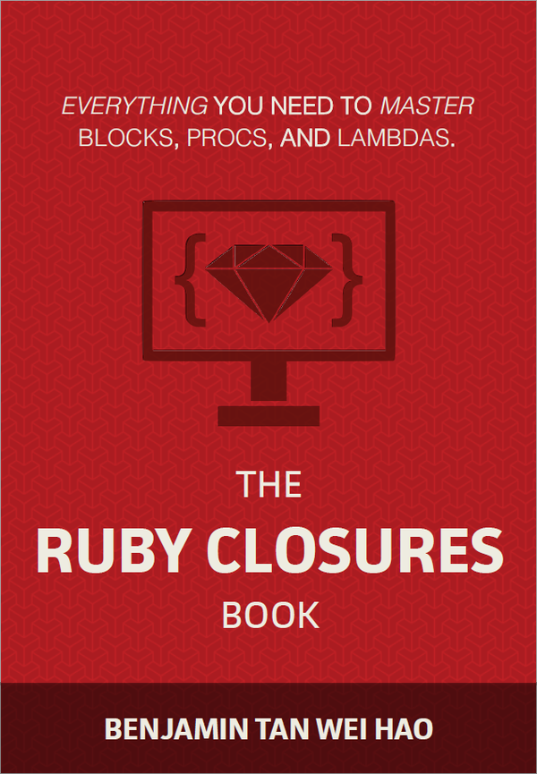

[&lt;&lt; Back to project home](../README.md)

# The Ruby Closures Book

By the fantastic [Benjamin Tan Wei Hao](http://benjamintan.io/)

## Links:

- [Purchase The Ruby Closures Book](https://leanpub.com/therubyclosuresbook)

## Chapter Notes:

> blocks, procs, and lambdas are Ruby's implementation of closures.

- [Chapter 1. Closing in on Closures](ch01-closing-in-on-closures.md)
- [Chapter 2. Beautiful Blocks](ch02-beautiful-blocks.md)
- [Chapter 3. Proctology](ch03-proctology.md)
- [Chapter 4. Cheap Counterfeiting](ch04-cheap-counterfeiting.md)
- [Chapter 5. Epilogue](ch05-epilogue.md)

