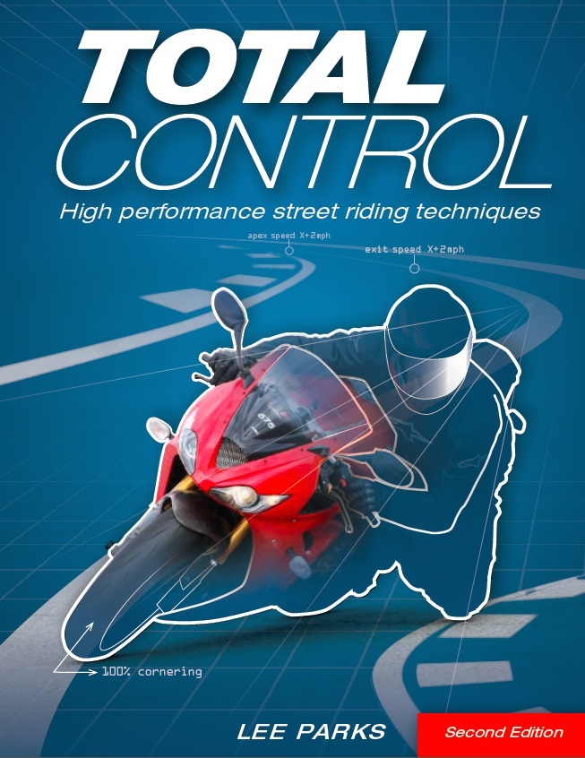

[🔙 🏡](../README.md)

# Total Control (2015)

By the howling [Lee Parks](https://www.totalcontroltraining.net/)

## Links:

- [Purchase Total Control](https://www.amazon.com/Total-Control-Performance-Street-Techniques/dp/0760343446)

## Chapter Notes:

01. **Chassis Dynamics**
    - [Chapter 1. Traction](ch01-traction.md)
    - [Chapter 2. Steering](ch02-steering.md)
    - [Chapter 3. Suspension](ch03-suspension.md)
02. **Mental Dynamics**
    - [Chapter 4. Fear](ch04-fear.md)
    - [Chapter 5. Concentration](ch05-concentration.md)
    - [Chapter 6. Right Attitude](ch06-right-attitude.md)
03. **Body Dynamics**
    - [Chapter 7. Vision](ch07-vision.md)
    - [Chapter 8. Line Selection](ch08-line-selection.md)
    - [Chapter 9. Throttle Control](ch09-throttle-control.md)
    - [Chapter 10. Shifting](ch10-shifting.md)
    - [Chapter 11. Braking](ch11-braking.md)
    - [Chapter 12. Body Positioning](ch12-body-positioning.md)
    - [Chapter 13. Low-Speed Turns](ch13-low-speed-turns.md)
    - [Chapter 14. Riding Two-Up](ch14-riding-two-up.md)
04. **Machine Setup**
    - [Chapter 15. Suspension Setup](ch15-suspension-setup.md)
    - [Chapter 16. Chassis Tuning](ch16-chassis-tuning.md)
    - [Chapter 17. Ergonomics](ch17-ergonomics.md)
    - [Chapter 18. Aerodynamics](ch18-aerodynamics.md)
05. **Rider Setup**
    - [Chapter 19. Fitness](ch19-fitness.md)
    - [Chapter 20. Riding Gear](ch20-riding-gear.md)
    - [Chapter 21. Epilogue](ch21-epilogue.md)

