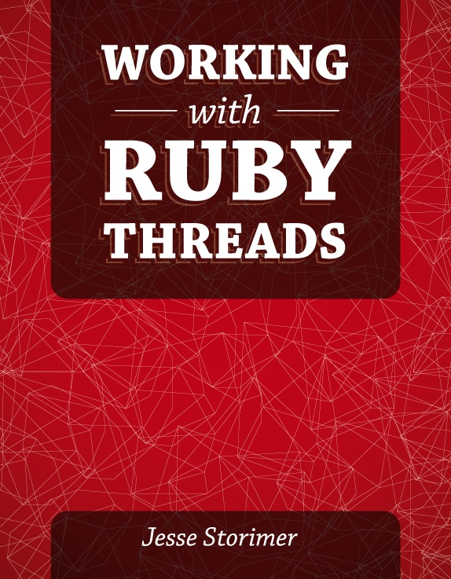

[&lt;&lt; Back to project home](../README.md)

# Working with Ruby Threads

By the howling [Jesse Storimer](http://www.jstorimer.com/)

[Purchase](http://www.jstorimer.com/products/working-with-ruby-threads)

> Atomic means it can't be interrupted. `||=` is not atomic.

> Use mutexes to read and write data that may be shared.

Just need some guidance on writing thread-safe code? Check out [Chapter 12. Writing Thread-Safe Code](ch12-writing-thread-safe-code.md)

An eloquent set of rules can be found on the
[JRuby wiki](https://github.com/jruby/jruby/wiki/Concurrency-in-jruby#concurrency_basics):

The safest path to concurrency:

1. Don't do it.
2. If you must do it, don't share data across threads.
3. If you must chare data across threads, don't share mutable data.
4. If you must share mutable data across threads, synchronize access to that
   data.

If you stick to these rules, you'll strike that balance.

Notes:

- [Chapter 1. You're Always in a Thread](ch01-you-re-always-in-a-thread.md)
- [Chapter 2. Threads of Execution](ch02-threads-of-execution.md)
- [Chapter 3. Lifecycle of a Thread](ch03-lifecycle-of-a-thread.md)
- [Chapter 4. Concurrent != Parallel](ch04-concurrent-is-not-parallel.md)
- [Chapter 5. The GIL and MRI](ch05-the-gil-and-mri.md)
- [Chapter 6. Real Parallel Threading with JRuby and Rubinius](ch06-real-parallel-threading-with-jruby-and-rubinius.md)
- [Chapter 7. How Many Threads Are Too Many?](ch07-how-many-threads-are-too-many.md)
- [Chapter 8. Thread Safety](ch08-thread-safety.md)
- [Chapter 9. Protecting Data with Mutexes](ch09-protecting-data-with-mutexes.md)
- [Chapter 10. Signaling Threads with Condition Variables](ch10-signaling-threads-with-condition-variables.md)
- [Chapter 11. Thread-Safe Data Structures](ch11-thread-safe-data-structures.md)
- [Chapter 12. Writing Thread-Safe Code](ch12-writing-thread-safe-code.md)
- [Chapter 13. Thread-Safety on Rails](ch13-thread-safety-on-rails.md)
- [Chapter 14. Wrap Your Threads in an Abstraction](ch14-wrap-your-threads-in-an-abstraction.md)
- [Chapter 15. How Sidekiq Uses Celluloid](ch15-how-sidekiq-uses-celluloid.md)
- [Chapter 16. Puma's Thread Pool Implementation](ch16-puma-s-thread-pool-implementation.md)
- [Chapter 17. Closing](ch17-closing.md)

