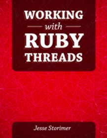

[&lt;&lt; Back to project home](../README.md)

# Working with Ruby Threads

By [Jesse Storimer](http://www.jstorimer.com/). [Buy Online](http://www.jstorimer.com/products/working-with-ruby-threads)

Notes:

- [Chapter 1. Threads of Execution](ch1-threads-of-execution.md)
- [Chapter 2. Lifecycle of a Thread](ch2-thread-lifecycle.md)
- [Chapter 3. Concurrent != Parallel](ch3-concurrent-is-not-parallel.md)
- [Chapter 4. The GIL and MRI](ch4-gil-and-mri.md)
- [Chapter 5. Real Parallel Threading with JRuby and Rubinius](ch5-real-threading.md)
- [Chapter 6. How Many Threads Are Too Many?](ch6-how-many-threads-are-too-many.md)
- [Chapter 7. Thread Safety](ch7-thread-safety.md)
- [Chapter 8. Protecting Data with Mutexes](ch8-protecting-data-with-mutexes.md)
- [Chapter 9. Signaling Threads with Condition Variables](ch9-threads-and-conditions.md)
- [Chapter 10. Thread-Safe Data Structures](ch10-thread-safe-data-structures.md)
- [Chapter 11. Writing Thread-Safe Code](ch11-writing-thread-safe-code.md)
- [Chapter 12. Thread-Safety on Rails](ch12-thread-safety-on-rails.md)
- [Chapter 13. Wrap Your Threads in an Abstraction](ch13-abstract-your-threads.md)
- [Chapter 14. How Sidekiq Uses Celluloid](ch14-how-sidekiq-uses-celluloid.md)
- [Chapter 15. Puma's Thread Pool Implementation](ch15-pumas-thread-pool.md)
- [Chapter 16. Closing](ch16-closing.md)

