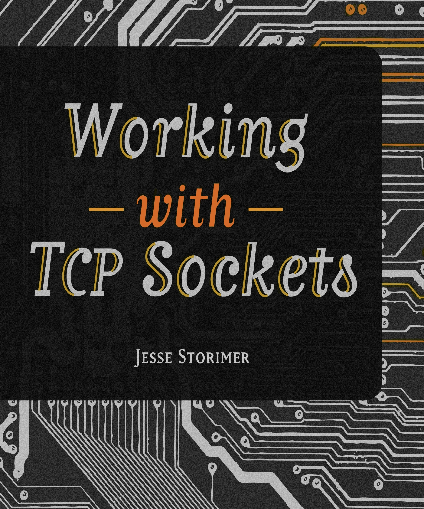

[&lt;&lt; Back to project home](../README.md)

# Working with TCP Sockets

By the tremendous [Jesse Storimer](http://www.jstorimer.com/)

## Links:

- [Purchase Working with TCP Sockets](http://www.jstorimer.com/products/working-with-tcp-sockets)

## Chapter Notes:

- [Chapter 1. Your First Socket](ch01-your-first-socket.md)
- [Chapter 2. Establishing Connections](ch02-establishing-connections.md)
- [Chapter 3. Server Lifecycle](ch03-server-lifecycle.md)
- [Chapter 4. Client Lifecycle](ch04-client-lifecycle.md)
- [Chapter 5. Exchanging Data](ch05-exchanging-data.md)
- [Chapter 6. Sockets Can Read](ch06-sockets-can-read.md)
- [Chapter 7. Sockets Can Write](ch07-sockets-can-write.md)
- [Chapter 8. Buffering](ch08-buffering.md)
- [Chapter 9. Our First Client/Server](ch09-our-first-client-server.md)
- [Chapter 10. Socket Options](ch10-socket-options.md)
- [Chapter 11. Non-Blocking IO](ch11-non-blocking-io.md)
- [Chapter 12. Multiplexing Connections](ch12-multiplexing-connections.md)
- [Chapter 13. Nagle's Algorithm](ch13-nagles-algorithm.md)
- [Chapter 14. Framing Messages](ch14-framing-messages.md)
- [Chapter 15. Timeouts](ch15-timeouts.md)
- [Chapter 16. DNS Lookups](ch16-dns-lookups.md)
- [Chapter 17. SSL Sockets](ch17-ssl-sockets.md)
- [Chapter 18. Urgent Data](ch18-urgent-data.md)
- [Chapter 19. Network Architecture Patterns](ch19-network-architecture-patterns.md)
- [Chapter 20. Serial](ch20-serial.md)
- [Chapter 21. Process per Connection](ch21-process-per-connection.md)
- [Chapter 22. Thread per Connection](ch22-thread-per-connection.md)
- [Chapter 23. Preforking](ch23-preforking.md)
- [Chapter 24. Thread Pool](ch24-thread-pool.md)
- [Chapter 25. Evented (Reactor)](ch25-evented--reactor-.md)
- [Chapter 26. Hybrids](ch26-hybrids.md)
- [Chapter 27. Closing Thoughts](ch27-closing-thoughts.md)

